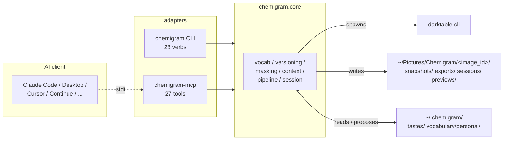

# Chemigram

[](https://github.com/chipi/chemigram/actions/workflows/ci.yml)
[](https://chipi.github.io/chemigram/)
[](https://github.com/chipi/chemigram/releases)
[](docs/LICENSING.md)
[](https://www.python.org)
[](https://github.com/astral-sh/ruff)

> Chemigram is to photos what Claude Code is to code.

A craft-research project for agent-driven photo editing. The agent reads
your taste, you describe intent, the agent edits via a vocabulary of
named moves on top of darktable. Sessions accumulate; the project gets
richer over time.

**Status:** v1.10.0 shipped May 2026 — Phase 1 closed at v1.0.0
(minimum viable loop), Phase 2 in progress (use-driven vocabulary
maturation). v1.6–v1.8 closed Lightroom daily-use parity (51/52, 98%);
v1.10.0 added the **photographer-workflows survey** vocabulary
expansion (29 new L2 looks across 6 genres + colorequal-based
bw_convert v2) plus three workflow primitives: parametric L2
strength (RFC-035 / ADR-088), mixed-op `apply_per_region`
(RFC-036 / ADR-089), and `propagate_state` (RFC-037 / ADR-090,
the Lightroom-Sync analog). v1.9.0 closed the **mask + retouch
architecture trilogy**: spatial masks (RFC-029 / ADR-084),
parametric range filters (RFC-024 / ADR-085), LLM-vision
content-derived masks (RFC-026 / ADR-086), spot heal/clone
(RFC-025 / ADR-087). 1849 tests, real-darktable e2e suite, **114
vocabulary entries** (2 starter + 112 expressive-baseline). Not a
Lightroom replacement. Not a digital asset manager. A probe into
where photographic taste lives and how it transmits through
language and feedback.

## What this is

A photo is a project, structured the way a code project is. The agent
reads your context (`taste.md`, the brief, accumulated notes), drives
darktable headlessly through composable vocabulary primitives, manages
masks and snapshots, and learns across sessions. Two modes:

- **Mode A (the journey)** — collaborative editing where you and the
  agent work through one photo together, conversationally.
- **Mode B (autonomous fine-tuning)** — agent runs alone, branching to
  explore variants, self-evaluating against criteria you provide.

## Built on darktable

Every pixel decision in chemigram is made by [**darktable**](https://www.darktable.org/) —
the open-source raw photography workflow that has quietly become one
of the best photo processing engines in the world. Scene-referred
pipeline, perceptually accurate color science, sigmoid + filmic tone
mapping, the colorequal HSL panel, lens correction via lensfun,
denoising profiles per-camera, drawn-form masks with feathered blendif,
parametric range masks, retouch heal/clone — all of it ships in
darktable, written by a community of brilliant photographers and
engineers over more than a decade. The work is uncompromising. The
output, in our experience, exceeds what most commercial alternatives
produce.

**chemigram does no photography.** It contributes orchestration:
vocabulary, an agent loop, versioning, session capture, and the
discipline that wraps darktable into something an LLM can drive with
intent. Strip chemigram away and darktable still produces the same
beautiful renders; strip darktable away and chemigram is a pile of
JSON. The architectural commitment is explicit and load-bearing — see
[CLAUDE.md § "darktable does the photography, Chemigram does the loop"](CLAUDE.md).

If you're new to darktable: **try it**. It's free, it's MIT-spirited
(GPLv3), it runs natively on macOS / Linux / Windows, and the
[user manual](https://docs.darktable.org/usermanual/) is one of the
most thorough pieces of open-source documentation we've ever read.
The [darktable GitHub repository](https://github.com/darktable-org/darktable)
is where the work happens. If you ship raw work, this is the engine
you want; chemigram or no chemigram, the darktable team has earned
your attention.

## What makes it different

- **Vocabulary, not sliders.** The agent's action space is a finite
  set of named moves you (or the community) author as `.dtstyle`
  files. Articulating the vocabulary is part of the experiment.
- **Three foundational disciplines** in the architecture:
  - *darktable does the photography, Chemigram does the loop*
  - *Bring Your Own AI* — maskers, evaluators, the photo agent itself
    are all configurable via MCP
  - *Agent is the only writer* — full library isolation, replace
    semantics, predictable action space
- **Mini git for photos.** Content-addressed DAG of edit snapshots
  per image. Branches, tags, the works.
- **Compounding context.** Each session reads your `taste.md` and
  per-image notes; agent proposes additions; you confirm. Future
  sessions are faster and more aligned because context accumulates.

## Status and roadmap

| Phase | What | Status |
|-|-|-|
| 0 | Hands-on validation of darktable composition story | ✅ Closed green |
| Doc system | Concept package + PRDs/RFCs/ADRs | ✅ Complete |
| 1 | Core engine + MCP server + starter vocabulary | ✅ Closed (v1.0.0) — Slices 1–6 shipped (ADR-050..061). |
| 1.1 | Comprehensive validation — capability matrix + real-darktable e2e | ✅ Closed (v1.1.0) — 3 engine bugs fixed (ADR-062). |
| 1.2 | Engine unblock + reference-image validation infrastructure | ✅ Closed (v1.2.0) — Path B synthesizer + assertion library + Mode A v3 (ADR-063..068). |
| 1.3 | Command-line interface | ✅ Closed (v1.3.0) — 22 verbs mirroring MCP; ADR-069..072 closed RFC-020. |
| 1.4 | `expressive-baseline` vocabulary authoring | ✅ Closed (v1.4.0) — 35 entries authored programmatically (Path C) + 4 drawn-mask-bound entries. |
| 1.5 | Mask architecture cleanup (drawn-only) | ✅ Closed (v1.5.0) — ADR-076 retired the PNG-based mask infrastructure that turned out to be a silent no-op. |
| 1.6 | Parameterized vocabulary (Path C as default) | ✅ Closed (v1.6.0) — RFC-021 / ADR-077..080. 18 parameterized entries across 11 modules. |
| 1.7 | Tier 2 expansion + Lightroom-parity Bucket A | ✅ Closed (v1.7.0) — RFC-022 / ADR-081 tiering policy; A.1–A.7 buckets shipped. |
| 1.8 | HSL via colorequal + denoise + lens + filmic v6 | ✅ Closed (v1.8.0) — RFC-023 / ADR-083; #95–#97 visual proofs verified. Lightroom daily-use parity 51/52 (98%). |
| 1.9 | Mask + retouch architecture trilogy | ✅ Closed (v1.9.0) — RFC-024 / ADR-085 (parametric range), RFC-025 / ADR-087 (spot heal/clone), RFC-026 / ADR-086 (LLM-vision masks), RFC-029 / ADR-084 (compositional masks). RFC-030 deferred (deployed sibling-provider precision tier). |
| 2 | Vocabulary maturation — grow vocab from session evidence | In progress (use-driven; intermittent). 83 entries shipped. |
| 3+ | Multi-photographer review / pack management / AI provider scaffolding | Conditional / future — RFC-027, RFC-028, RFC-030. |

For the canonical phase plan and current status, see `docs/IMPLEMENTATION.md`.

## Quickstart — conversational (MCP)

For interactive editing through Claude Desktop, Claude Code, and other MCP clients.

```bash
# 1. install
pip install chemigram

# 2. set up your taste (cross-image preferences)
mkdir -p ~/.chemigram/tastes
$EDITOR ~/.chemigram/tastes/_default.md   # what you generally like

# 3. point your AI client at chemigram-mcp.  e.g. for Claude Code, drop this
#    into .mcp.json (project) or ~/.claude/mcp.json (global):
#
#    {"mcpServers": {"chemigram": {"command": "chemigram-mcp"}}}

# 4. start a conversation in your client:
#    "Ingest /path/to/photo.NEF.  Read context.  Render a preview."
```

For the full flow — darktable setup, MCP-client matrix (Claude Code / Desktop, Cursor, Continue, Cline, Zed, OpenAI), 10-turn worked session, troubleshooting — read **[`docs/getting-started.md`](docs/getting-started.md)**.

## Quickstart — scripts and agent loops (CLI, v1.3.0+)

For batch processing, shell scripts, and agent loops where MCP's session model is the wrong shape. The CLI mirrors the MCP tool surface verb-for-verb (`chemigram apply-primitive` ↔ MCP `apply_primitive`); see PRD-005 / RFC-020 for the design.

```bash
# 1. install — same as above
pip install chemigram   # also lands `chemigram` on $PATH

# 2. inspect the runtime
chemigram status

# 3. ingest a raw + apply a vocabulary entry
export CHEMIGRAM_DT_CONFIGDIR=~/chemigram-phase0/dt-config   # see getting-started for setup
chemigram ingest ~/Pictures/raw/iguana.NEF
chemigram apply-primitive iguana --entry exposure --value 0.5 --pack expressive-baseline
chemigram render-preview iguana --size 1024
chemigram export-final iguana --format jpeg

# 4. machine-readable output for scripts and agents (NDJSON)
chemigram --json apply-primitive iguana --entry wb_warm_subtle
# {"event":"result","status":"ok","image_id":"iguana", ...}
```

The CLI is stateless per invocation — parallel calls against different images are safe. The image_id derives from the raw filename's stem (case-preserving): `iguana.NEF` → `iguana`, `IMG_2041.ARW` → `IMG_2041`. **Concurrent calls against the same image are not tested**; the engine writes refs without an explicit fcntl lock, so serialize at the caller level if a single image is touched by multiple subprocesses simultaneously. For the full verb surface, see [`docs/guides/cli-reference.md`](docs/guides/cli-reference.md). For driving Chemigram from a custom agent loop, see the "Agent loops" section of [`docs/getting-started.md`](docs/getting-started.md).

## How it works



For the full architecture (subsystem breakdown, mask trilogy, vocabulary
layers, release timeline) see [`docs/diagrams/`](docs/diagrams/index.md).

The agent reads your context and the brief, drives darktable through a vocabulary of named moves, manages snapshots, binds drawn-form masks where the vocabulary calls for them, and proposes updates to your taste files at session end. Every tool call is recorded to a JSONL transcript so sessions are auditable and replayable.

A typical 6-turn opening:

```
You:    Ingest /tmp/manta.NEF.  Read context.

Agent:  Ingested as image_id "manta".  Tastes loaded:
        natural tone curves, lifted shadows, restrained colors.
        EOS R5, no L1 templates yet.  Notes empty.

You:    Render preview.  The water feels too cyan and the top
        of the frame is blown by sun glare.

Agent:  [render → wb_warm_subtle → render]  Slate-blue now.
        For the glare, I'd reach for gradient_top_dampen_highlights —
        binds a -0.5 EV exposure through a top-bright drawn gradient.
        Try it?

You:    Yes.  And lift the foreground where the manta sits.

Agent:  [apply gradient_top_dampen_highlights →
         apply gradient_bottom_lift_shadows → render]  Top dampened,
        foreground lifted +0.4 EV.  Manta reads with more presence.

You:    Tag v1-export and run a full-res JPEG.

Agent:  [tag → export_final]  Done.  Two propose-and-confirms before
        we wrap?
```

See **[`docs/getting-started.md`](docs/getting-started.md#your-first-session)** for a full 10-turn walkthrough.

## Growing your vocabulary

The starter vocabulary that ships with `chemigram` is deliberately small — two entries (a warm-WB nudge, an L2 neutral look). The companion `expressive-baseline` pack adds 81 more entries: 18 parameterized primitives across 11 modules (Path C; RFC-021), 13 L2 looks (cinematic / portrait / decade / 5 compositional-mask looks via the v1.9.0 trilogy), L3 discrete kinds + 4 mask-bound primitives. Plus the **`apply_spot` MCP tool** (RFC-025 / ADR-087) for blemish removal / cloning. Phase 2 grows the vocabulary from real session evidence: the agent logs gaps when it reaches for moves you don't have; once a month or so, you open darktable, capture the missing primitives as `.dtstyle` files, and drop them into `~/.chemigram/vocabulary/personal/`. After 3 months of regular use most photographers reach 30–60 personal entries; after 6 months, 80–120. The vocabulary becomes an articulation of *your* craft.

Full procedure in **[`docs/getting-started.md`](docs/getting-started.md#growing-your-vocabulary)** and **[`vocabulary/starter/README.md`](vocabulary/starter/README.md)**.

## Documentation

For users:

- **[`docs/getting-started.md`](docs/getting-started.md)** — install, MCP-client config, first session, troubleshooting, CLI quickstart
- **[`docs/guides/tastes-quickstart.md`](docs/guides/tastes-quickstart.md)** — your first taste file in 5 minutes
- **[`docs/guides/cookbook.md`](docs/guides/cookbook.md)** — "I want X look → here's the recipe." ~60 intent-driven worked examples grouped by genre + mask-driven moves + workflow primitives. First stop for "how do I do X."
- **[`docs/guides/vocabulary-patterns.md`](docs/guides/vocabulary-patterns.md)** — recipes for combining primitives ("for *X* intent, reach for *Y* composition")
- **[`docs/guides/recipes.md`](docs/guides/recipes.md)** — common "how do I" patterns: reset to baseline, find by tag, export multiple sizes, replay a session
- **[`docs/guides/cli-reference.md`](docs/guides/cli-reference.md)** — every verb, every flag, every exit code
- **[`docs/guides/cli-output-schema.md`](docs/guides/cli-output-schema.md)** — NDJSON event format for `--json` output
- **[`docs/guides/cli-env-vars.md`](docs/guides/cli-env-vars.md)** — env var reference
- **[`docs/guides/config-toml.md`](docs/guides/config-toml.md)** — `~/.chemigram/config.toml` schema
- **[`vocabulary/starter/README.md`](vocabulary/starter/README.md)**, **[`vocabulary/packs/expressive-baseline/README.md`](vocabulary/packs/expressive-baseline/README.md)** — what ships in each pack
- **[`examples/iguana-galapagos.md`](examples/iguana-galapagos.md)** — a worked Mode A session, prose form
- **[`examples/cli-agent-loop.py`](examples/cli-agent-loop.py)** + **[`examples/cli-batch-watch.sh`](examples/cli-batch-watch.sh)** — runnable CLI examples

For contributors and people engaging with the project deeper:

- **[`docs/guides/authoring-vocabulary-entries.md`](docs/guides/authoring-vocabulary-entries.md)** — Phase 2 daily-use authoring flow
- **[`docs/guides/expressive-baseline-authoring.md`](docs/guides/expressive-baseline-authoring.md)** — programmatic struct-RE methodology (Path C)
- **`docs/concept/`** — six numbered concept documents (read end-to-end, ~2h):
  `00-introduction.md`, `01-vision.md`, `02-project-concept.md`,
  `03-data-catalog.md`, `04-architecture.md`, `05-design-system.md`
- **`docs/prd/`**, **`docs/rfc/`**, **`docs/adr/`** — definition documents (PRDs argue user-value; RFCs argue open technical questions; ADRs commit to settled decisions). Anchored by `docs/prd/PA.md` and `docs/adr/TA.md`.
- **`docs/IMPLEMENTATION.md`** — canonical phase plan
- **`docs/CONTRIBUTING.md`** — code + vocabulary contribution flows
- **`docs/LICENSING.md`** — what's MIT, what's separate
- **`docs/TODO.md`** — research backlog, deferred items
- **[`docs/guides/index.md`](docs/guides/index.md)** — full guides index, organized by audience

## Requirements

- darktable 5.x (Apple Silicon native build recommended)
- Python 3.11+
- An MCP-capable AI client — Claude Code, Claude Desktop, Cursor, Continue, Cline, Zed, or anything that supports MCP stdio servers
- macOS Apple Silicon for v1; Linux best-effort

## Contributing

If you want to work on the engine itself (not just use it):

```bash
git clone https://github.com/chipi/chemigram.git
cd chemigram
./scripts/setup.sh
```

That checks prerequisites, creates a venv, and installs everything. See [`docs/CONTRIBUTING.md`](docs/CONTRIBUTING.md) for the full process and [`docs/IMPLEMENTATION.md`](docs/IMPLEMENTATION.md) for what's being worked on now.

If you want to contribute vocabulary entries (Phase 2 path), see [`docs/CONTRIBUTING.md`](docs/CONTRIBUTING.md) § Vocabulary contributions.

## License

MIT. Engine, MCP server, docs, starter vocabulary, and borrowed community
packs are all permissively licensed. Personal vocabularies are kept in
separate private repos by photographers' choice. See `docs/LICENSING.md`
for the full picture.

## Why "Chemigram"?

A chemigram is a cameraless photographic process where an image emerges
from a chemical reaction on light-sensitive paper — guided by the
artist, but not fully controlled. The name fits: each edit here emerges
from a loop between a photographer's intent, an agent's moves, and a
tool that responds. Authorship is shared and the result is one-of-a-kind.

## Acknowledgments

[**darktable**](https://www.darktable.org/) is the foundation chemigram
stands on. The darktable team — maintainers, contributors, translators,
documentation writers — has built an open-source raw photography engine
that competes with and frequently exceeds proprietary alternatives. If
this project is useful, [donate to darktable](https://www.darktable.org/contact/),
file good bug reports, contribute translations, or just tell other
photographers to try it. The work the darktable community has shipped
makes everything chemigram does possible.

Other open-source foundations chemigram leans on with gratitude:
[Python](https://www.python.org/), [Anthropic's MCP](https://modelcontextprotocol.io/),
[ruff](https://github.com/astral-sh/ruff), [pytest](https://pytest.org/),
[uv](https://github.com/astral-sh/uv), [defusedxml](https://github.com/tiran/defusedxml),
[lensfun](https://lensfun.github.io/) (via darktable). And the photo
agent on the conversational side is whichever frontier LLM the
photographer chooses — chemigram is built so that piece is yours
to swap.
