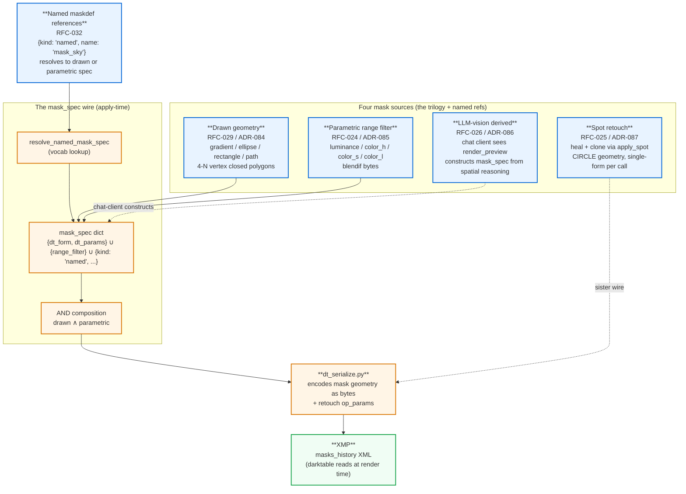

# Mask architecture trilogy

> Source: `docs/diagrams/mask-trilogy.md`. The mask system after v1.9.0 +
> v1.10.0. Four input sources flow into one wire (`mask_spec`) that
> serializes to darktable's XMP `masks_history` block.

v1.9.0 closed the mask + retouch architecture trilogy (RFC-024 + RFC-025
+ RFC-026 + RFC-029 → ADR-084..087); v1.10.0 added named-mask
references (RFC-032) on top. Before this trilogy chemigram had a
PNG-mask path that turned out to be a silent no-op (ADR-076 retired
it). The current architecture: every mask, regardless of source, ends
up as `masks_history` XML inside the XMP.

## Reading the diagram

- **Four blue inputs** — each mask source has its own RFC + ADR pair. They look different at the photographer's surface (a JSON `dt_form` is not the same shape as a `range_filter`, an LLM prompt, or a retouch coordinate), but they converge on one wire.
- **Named-mask references** (the `RFC-032` box) — the v1.10.0 addition. A photographer writes `{"kind": "named", "name": "mask_sky"}` and the vocabulary's maskdef store resolves it to whatever spec the maskdef declares (typically a parametric range filter for sky / skin / luminance bands).
- **AND composition** — drawn masks AND parametric range filters compose multiplicatively. "Bottom third (gradient) AND luminance shadows (range_filter)" gives you the dark pixels in the bottom third.
- **Retouch** uses the same byte-encoder but doesn't go through the mask_spec wire — `apply_spot` is a sister verb. The reason: retouch carries op_params that reference a mask via `mask_id`, not via the `mask_spec` field.
- **darktable reads `masks_history`** at render time; the engine never reads it back. The XMP is the contract.

## What's NOT in this diagram

- The v0.3.0–v1.4.0 PNG-mask path (retired in v1.5.0 per ADR-076). darktable doesn't actually read external PNG files for raster masks; the entire system was a silent no-op.
- AI auto-spot-detection (find ALL the dust spots, not heal at one coord) — deferred to RFC-030 / deployed sibling-provider precision tier.

See also: `docs/guides/mask-applicable-controls.md` (per-module compatibility), `docs/guides/mask-shapes-from-words.md` (drawn-form recipes), `docs/guides/llm-vision-for-masks.md` (Pattern 7 — vision construction).
