# Phase 1 timeline

> Source: `docs/diagrams/phase-1-timeline.md`. The release sequence from
> Phase 0 validation through v1.10.0 ship.

Phase 1 is "minimum viable loop"; v1.6 + v1.7 + v1.8 widened the
parameterized vocabulary surface; v1.9.0 closed the mask + retouch
architecture trilogy; v1.10.0 added photographer-survey vocabulary
plus three workflow primitives. Phase 2 (vocabulary maturation) is
ongoing and intermittent — it isn't slice-and-gate.

```mermaid
%%{init: {'theme':'neutral'}}%%
timeline
    title Chemigram release sequence
    section Phase 0 - 2026 Q1
        Phase 0 validation: 8 findings logged to ADRs
        Doc system populated: PRDs RFCs ADRs references
    section Phase 1 - 2026 Q2 (Apr-May)
        v1.0.0 - minimum viable loop: Slices 1-6 shipped
                                    : ADR-050..061
                                    : Issue 1-29 closed
        v1.1.0 - validation: 519 tests
                          : 3 engine bugs root-caused (ADR-062)
        v1.2.0 - engine unblock: synthesizer Path B
                              : real-darktable e2e suite
                              : ADR-063..068
        v1.3.0 - CLI: 22 verbs mirroring MCP
                   : RFC-020 closed via ADR-069..072
        v1.4.0 - expressive-baseline vocab: 35 entries
                                          : Path C decoders shipped
                                          : 4 drawn-mask-bound entries
        v1.5.0 - mask cleanup: ADR-076 retires PNG-mask path
                            : drawn-form only
    section Phase 1.6-1.8 - parameterization + Lightroom parity
        v1.6.0 - parameterized vocab: RFC-021/ADR-077..080
                                    : 18 parameterized entries
                                    : 11 modules
        v1.7.0 - Tier 2 expansion: RFC-022 / ADR-081
                                 : Color Grading 9 axes
                                 : dehaze + texture + ashift
        v1.8.0 - HSL + denoise + lens + filmic: RFC-023/ADR-083
                                              : Lightroom parity 51 of 52
    section Phase 1.9 - mask trilogy + 1.10 survey work
        v1.9.0 - mask architecture trilogy: RFC-024/025/026/029
                                          : ADR-084..087
                                          : apply_spot MCP tool
                                          : 83 vocabulary entries
        v1.10.0 - photographer-survey + workflow primitives: RFC-035/036/037
                                                           : ADR-088/089/090 Draft
                                                           : 29 new L2 looks across 6 genres
                                                           : bw_convert v2 (Adams-school)
                                                           : 114 entries
                                                           : 1868 unit+integration tests
    section Phase 2 - 2026 Q2+ (ongoing)
        Vocabulary maturation (use-driven): Author personal entries from session evidence
                                          : Markers ~30-60 personal entries per 3mo
        Darkroom session validation: Flip ADR-088/089/090 Draft to Accepted
        RFC-038 Mode B (drafted): v1.11+ pick - autonomous fine-tuning
```

## Reading the diagram

- **Phase 0** was hands-on validation — manual XMP composition + darktable invocation evidence. 8 findings landed as ADRs (ADR-005 subprocess serialization, ADR-008 opaque op_params, etc.) before any engine code shipped.
- **Phase 1.0 → 1.5** built the substrate: engine, MCP server, CLI, the first vocabulary pack, the cleaned-up mask architecture (ADR-076 retired the PNG-mask path that turned out to be a silent no-op).
- **Phase 1.6 → 1.8** parameterized the magnitude-ladder modules (RFC-021), shipped Tier 2 expansion (RFC-022), and closed Lightroom daily-use parity at 51/52 modules.
- **Phase 1.9** closed the mask + retouch architecture trilogy — drawn forms, parametric range filters, LLM-vision as provider, and spot heal/clone — all routing through one `mask_spec` wire.
- **Phase 1.10** grounded the L2 vocabulary in a 6-genre photographer-workflow survey (36 photographers) and added three workflow primitives (parametric L2 strength, mixed-op `apply_per_region`, `propagate_state` Lightroom-Sync analog).
- **Phase 2** is the use-driven phase. The substrate is shipped; growth is from real session evidence (`vocabulary_gaps.jsonl`) feeding into personal pack additions.

See also: `docs/IMPLEMENTATION.md` (canonical phase plan), `CHANGELOG.md` (per-release detail), `docs/capability-survey.md` (post-v1.10.0 state).
