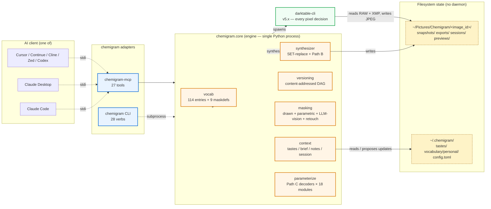

# Chemigram stack diagram

> Source: `docs/diagrams/stack.md`. GitHub + MkDocs render Mermaid blocks
> natively. Edit this file when the stack shape changes.

The stack: an AI client drives `chemigram-mcp` over stdio (or any other
MCP transport), `chemigram-mcp` and the `chemigram` CLI both dispatch
through `chemigram.core`, and `chemigram.core` invokes `darktable-cli`
as a subprocess to render. State lives on the filesystem at
`~/Pictures/Chemigram/<image_id>/`. Every pixel decision is made by
darktable; chemigram contributes orchestration only.

## Reading the diagram

- **Solid arrows** = in-process function calls.
- **Dotted arrows** = subprocess / IPC (stdio for MCP, fork+exec for CLI ↔ core, fork+exec for darktable-cli).
- **Blue nodes** (`MCP`, `CLI`) — adapter layers; thin wrappers over `chemigram.core` (lint-enforced per ADR-071).
- **Orange nodes** — `chemigram.core` subsystems.
- **Green node** — external dependency. The architectural commitment ("darktable does the photography, Chemigram does the loop"; CLAUDE.md § "The three foundational disciplines") means this box is the entire pixel-processing surface.
- **Yellow dashed nodes** — filesystem state (the project explicitly has no daemon / no in-memory persistence; the filesystem IS the state).

See also: `docs/diagrams/mask-trilogy.md`, `docs/diagrams/vocabulary-layers.md`, `docs/diagrams/phase-1-timeline.md`.
