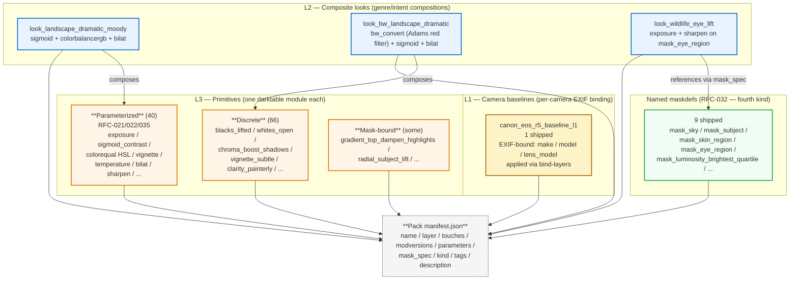

# Vocabulary layer architecture

> Source: `docs/diagrams/vocabulary-layers.md`. The L1 / L2 / L3 layered
> vocabulary that the agent's action space lives in.

The vocabulary is a finite, named action space. Three layers compose:
**L1** camera baselines (rare; per-camera EXIF binding), **L3** discrete
or parameterized primitive moves on a single darktable module, and
**L2** composite looks that stack L3 primitives. A fourth top-level
kind, **maskdefs** (RFC-032), names spatial / parametric mask
geometries that any primitive can reference.

## Reading the diagram

- **L1** is the rarest layer. Camera-specific baselines that auto-apply at ingest based on EXIF make/model/lens. Most workflows don't need L1 entries.
- **L2** is the composition layer. Each L2 look is a `dtstyle` file declaring multiple plugins; the synthesizer applies them as one move. L2 looks compose either by direct dtstyle (multi-plugin) or by `mask_spec` reference into an L3 primitive at a specific mask.
- **L3** is the primitive layer. Three flavors:
  - **Parameterized** (40 entries, 18 modules): one `dtstyle` template + a `parameters` block declaring the axis names / ranges. Applied with `--value` (single-axis shorthand) or `--param NAME=V` (multi-axis).
  - **Discrete** (66 entries): fixed-value `dtstyle` files. Often a "kind of move" (different sigma / midtone shape) rather than a different intensity.
  - **Mask-bound** (subset of L3 + L2): carry a `mask_spec` in the manifest so they auto-apply through a mask at apply time.
- **Maskdefs** (RFC-032) are the fourth kind — they declare named, reusable mask geometries that any primitive can reference via `{"kind": "named", "name": "mask_X"}`. The named-mask resolution happens at apply time against the loaded vocabulary.

## Counts at v1.10.0

| Layer | Count | Notes |
|-|-|-|
| L1 | 1 | `canon_eos_r5_baseline_l1` |
| L2 | 46 | composite looks across 6 genres + cinematic + decade |
| L3 | 67 | 40 parameterized + 27 discrete (kinds + mask-bound) |
| **Maskdefs** | 9 | sky / subject / skin_region / eye_region / 5 luminosity + foliage_green + water_blue_cyan |
| **Total catalog** | 123 | 114 vocabulary primitives + 9 named maskdefs |

## What's NOT in this diagram

- L4 / L5 don't exist. The layer system is finite by design (ADR-001).
- The historical PNG-raster mask layer (ADR-076 retired it in v1.5.0; replaced by drawn-form geometry).

See also: `docs/diagrams/mask-trilogy.md` (mask-spec wire), `docs/concept/02-project-concept.md` (vocabulary as voice), `docs/guides/authoring-vocabulary-entries.md` (writing new entries).
