# Mask shapes from words

> Companion to RFC-029 / ADR-084. The build-by-words mapping for the agent: spatial English on the left, the `mask_spec` dict on the right.
> Sister to the `mask-applicable-controls.md` guide — that one tells you *which primitive* you can apply through a mask; this one tells you *how to construct the mask* from a phrase.

## When to use this

The agent calls `apply_primitive` with an inline `mask_spec` argument when the photographer's intent is *spatial* — affect a region, not just a tonal range. "Lift the bottom third by half a stop" is spatial. "Lift the shadows" is tonal (no mask needed; the primitive's parameter handles it).

This guide gives you a stable vocabulary so the same phrase produces the same `mask_spec` across sessions. It's not exhaustive — the agent's job is to reason about what the photographer actually means and pick parameters accordingly. Treat the table as a foundation; extrapolate when the phrase doesn't match exactly.

## Coordinate system

All mask coordinates are normalized to `[0, 1]` in image space:

- `x = 0` is the left edge, `x = 1` is the right edge
- `y = 0` is the **top** edge, `y = 1` is the **bottom** edge

Origin is top-left, matching darktable's convention. Coordinates are unitless — the same `mask_spec` applies to a 4000×3000 photo and a 1024×768 thumbnail identically.

## Shape choice: rectangle vs gradient vs ellipse vs path

| Intent | Shape | Why |
|-|-|-|
| Hard edge ("the bottom third, no feathering") | rectangle | Sharp boundary, full opacity inside, zero outside |
| Smooth transition ("a gentle fade from top") | gradient | Linear falloff across the image; one side bright, other dark |
| Circular subject region ("around the face") | ellipse | Radial falloff with feathering; tracks circular subjects |
| Arbitrary outline ("the silhouette of the fish") | path | N-vertex closed polygon; usually from RFC-026 AI subject detection or human-supplied vertices |

Two questions guide the choice:

1. **Does the intent describe a half-plane or a region?** Half-plane → gradient. Region → rectangle / ellipse / path.
2. **Should the boundary be hard or feathered?** Hard → rectangle. Feathered → gradient (for half-plane) or ellipse (for region) or path-with-border.

If the photographer says "the bottom third" without qualifying, default to `gradient` (it's almost always what they mean — a smooth transition feels natural).

## Phrase → spec table

### Halves and thirds (gradients)

| Phrase | Spec |
|-|-|
| "Bottom half" / "lower half" | `{dt_form: "gradient", dt_params: {anchor_x: 0.5, anchor_y: 0.5, rotation: 180, compression: 0.5, state: 2}}` (light side is bottom; rotation 180 = horizontal axis with light below) |
| "Top half" / "upper half" | `{dt_form: "gradient", dt_params: {anchor_x: 0.5, anchor_y: 0.5, rotation: 0, compression: 0.5, state: 2}}` (rotation 0 = light side on top — verified against shipped `gradient_top_dampen_highlights`) |
| "Bottom third" | `{dt_form: "gradient", dt_params: {anchor_x: 0.5, anchor_y: 0.67, rotation: 180, compression: 0.5, state: 2}}` |
| "Top third" | `{dt_form: "gradient", dt_params: {anchor_x: 0.5, anchor_y: 0.33, rotation: 0, compression: 0.5, state: 2}}` |
| "Bottom quarter" | `{dt_form: "gradient", dt_params: {anchor_x: 0.5, anchor_y: 0.75, rotation: 180, compression: 0.5, state: 2}}` |
| "Top quarter" | `{dt_form: "gradient", dt_params: {anchor_x: 0.5, anchor_y: 0.25, rotation: 0, compression: 0.5, state: 2}}` |
| "Left half" | `{dt_form: "gradient", dt_params: {anchor_x: 0.5, anchor_y: 0.5, rotation: 90, compression: 0.5, state: 2}}` (rotation 90 = vertical axis, light side on left) |
| "Right half" | `{dt_form: "gradient", dt_params: {anchor_x: 0.5, anchor_y: 0.5, rotation: 270, compression: 0.5, state: 2}}` |
| "Left third" | `{dt_form: "gradient", dt_params: {anchor_x: 0.33, anchor_y: 0.5, rotation: 90, compression: 0.5, state: 2}}` |
| "Right third" | `{dt_form: "gradient", dt_params: {anchor_x: 0.67, anchor_y: 0.5, rotation: 270, compression: 0.5, state: 2}}` |

### Hard-edged regions (rectangles)

Use rectangles when the photographer wants a crisp boundary, not a smooth fade. Common in cinematic crops, letterbox effects, and "exactly this region."

| Phrase | Spec |
|-|-|
| "Bottom third (hard edge)" | `{dt_form: "rectangle", dt_params: {x0: 0, y0: 0.67, x1: 1, y1: 1, border: 0.0}}` |
| "Top half (hard edge)" | `{dt_form: "rectangle", dt_params: {x0: 0, y0: 0, x1: 1, y1: 0.5, border: 0.0}}` |
| "Center horizontal band" | `{dt_form: "rectangle", dt_params: {x0: 0, y0: 0.33, x1: 1, y1: 0.67, border: 0.0}}` |
| "Letterbox top band (10%)" | `{dt_form: "rectangle", dt_params: {x0: 0, y0: 0, x1: 1, y1: 0.1, border: 0.0}}` |
| "Letterbox bottom band (10%)" | `{dt_form: "rectangle", dt_params: {x0: 0, y0: 0.9, x1: 1, y1: 1, border: 0.0}}` |
| "Center square" | `{dt_form: "rectangle", dt_params: {x0: 0.25, y0: 0.25, x1: 0.75, y1: 0.75, border: 0.02}}` |
| "Upper-left quadrant" | `{dt_form: "rectangle", dt_params: {x0: 0, y0: 0, x1: 0.5, y1: 0.5, border: 0.0}}` |

### Circles / ellipses (subject-centered regions)

Use ellipses for "around the X" — face, subject, focal point. Default to feathering (`border: 0.05` or higher) to avoid hard circular edges.

| Phrase | Spec |
|-|-|
| "Center circle, small" | `{dt_form: "ellipse", dt_params: {center_x: 0.5, center_y: 0.5, radius_x: 0.15, radius_y: 0.15, border: 0.05}}` |
| "Center circle, medium" | `{dt_form: "ellipse", dt_params: {center_x: 0.5, center_y: 0.5, radius_x: 0.3, radius_y: 0.3, border: 0.08}}` |
| "Center circle, large" | `{dt_form: "ellipse", dt_params: {center_x: 0.5, center_y: 0.5, radius_x: 0.45, radius_y: 0.45, border: 0.1}}` |
| "Subject upper-left rule-of-thirds" | `{dt_form: "ellipse", dt_params: {center_x: 0.33, center_y: 0.33, radius_x: 0.2, radius_y: 0.2, border: 0.06}}` |
| "Subject upper-right rule-of-thirds" | `{dt_form: "ellipse", dt_params: {center_x: 0.67, center_y: 0.33, radius_x: 0.2, radius_y: 0.2, border: 0.06}}` |
| "Subject lower-left rule-of-thirds" | `{dt_form: "ellipse", dt_params: {center_x: 0.33, center_y: 0.67, radius_x: 0.2, radius_y: 0.2, border: 0.06}}` |
| "Subject lower-right rule-of-thirds" | `{dt_form: "ellipse", dt_params: {center_x: 0.67, center_y: 0.67, radius_x: 0.2, radius_y: 0.2, border: 0.06}}` |
| "Tall narrow oval (portrait subject)" | `{dt_form: "ellipse", dt_params: {center_x: 0.5, center_y: 0.5, radius_x: 0.2, radius_y: 0.4, border: 0.08}}` |
| "Wide flat oval (landscape mid-band)" | `{dt_form: "ellipse", dt_params: {center_x: 0.5, center_y: 0.5, radius_x: 0.45, radius_y: 0.15, border: 0.08}}` |

### Diagonals (rotated gradients)

Less common but useful for off-axis lighting situations.

| Phrase | Spec |
|-|-|
| "Diagonal, top-left dim" (light side bottom-right) | `{dt_form: "gradient", dt_params: {anchor_x: 0.5, anchor_y: 0.5, rotation: 225, compression: 0.5, state: 2}}` |
| "Diagonal, top-right dim" (light side bottom-left) | `{dt_form: "gradient", dt_params: {anchor_x: 0.5, anchor_y: 0.5, rotation: 135, compression: 0.5, state: 2}}` |
| "Diagonal, bottom-left dim" (light side top-right) | `{dt_form: "gradient", dt_params: {anchor_x: 0.5, anchor_y: 0.5, rotation: 315, compression: 0.5, state: 2}}` |
| "Diagonal, bottom-right dim" (light side top-left) | `{dt_form: "gradient", dt_params: {anchor_x: 0.5, anchor_y: 0.5, rotation: 45, compression: 0.5, state: 2}}` |

### Polygons (paths)

Path forms come from two sources: AI subject detection (RFC-026) and human-supplied vertex lists. The agent doesn't typically construct paths from words — it receives them from a provider tool or from explicit photographer input.

```jsonc
// Triangle in the upper half (programmatic example)
{
    "dt_form": "path",
    "dt_params": {
        "vertices": [[0.5, 0.1], [0.8, 0.4], [0.2, 0.4]],
        "border": 0.04
    }
}
```

When RFC-026 lands, the AI provider returns a polygon for "the fish" / "the person face" / etc.; the agent wraps it as a path-form `mask_spec` and applies primitives through it.

## Parameter cheat sheet

### Gradient (`dt_form: "gradient"`)

- `anchor_x`, `anchor_y`: where the gradient line crosses (the 50% point of the falloff). For a "bottom third" gradient, `anchor_y = 0.67` puts the transition line 2/3 down.
- `rotation` (degrees): orientation of the gradient axis. `0` = horizontal axis with the light side on **top** (verified against shipped `gradient_top_dampen_highlights`); `90` = vertical axis with light side on the **left**; `180` = horizontal with light on the **bottom**; `270` = vertical with light on the **right**. Rotate by 45° for diagonals (e.g., `45` = light on bottom-right).
- `compression` (default `0.5` for image-spanning thirds/halves): controls falloff width. `0.5` = sharper transition (half the image, recommended for crisp third/half regions); `1.0` = full-image falloff (very smooth); `2.0` = extends beyond image edges (extremely soft).
- `state` (default `2` = sigmoidal): `1` = linear falloff (sharp), `2` = sigmoidal (smooth, recommended for natural-looking masks).

### Ellipse (`dt_form: "ellipse"`)

- `center_x`, `center_y`: ellipse center, normalized [0, 1].
- `radius_x`, `radius_y`: ellipse half-widths. Equal values = circle. `0.15` is a small mask, `0.45` is a large one.
- `border` (default `0.05`): feathering width. `0.0` = hard edge (rare for circles); `0.05`–`0.10` = natural feathering; `>0.15` = very soft.
- `rotation` (default `0`): rotation in degrees. Only relevant for non-circular ellipses.
- `flags` (default proportional): `1` = border scales with shape; `0` = border is a fixed pixel distance (rarely needed).

### Rectangle (`dt_form: "rectangle"`)

- `x0`, `y0`: top-left corner.
- `x1`, `y1`: bottom-right corner.
- `border` (default `0.02`): feathering applied to all sides. `0.0` = hard edge; `0.02` = subtle softening.

### Path (`dt_form: "path"`)

- `vertices`: list of `[x, y]` pairs, normalized [0, 1], closed implicitly (last connects to first).
- `border` (default `0.02`): feathering uniform on all sides.
- Minimum 3 vertices. Typical AI-subject masks have 50–500 vertices after Douglas-Peucker simplification at the provider boundary (RFC-026).

## Refining masks with range filters (RFC-024 / ADR-085)

The shapes above describe the *region* of an image to affect. Sometimes that's not enough — the photographer wants "the bottom third *but only the dark pixels*" or "the subject *but only the warm tones*." Pixel-level refinement happens via the optional `range_filter` field on `mask_spec`.

```jsonc
mask_spec = {
    // Spatial component (optional)
    "dt_form": "gradient",
    "dt_params": {"anchor_y": 0.67, "rotation": 180, "compression": 0.5, "state": 2},

    // Pixel-level refinement (optional)
    "range_filter": {
        "kind": "luminance",     // or "color_h" / "color_s" / "color_l"
        "min": 0.0,              // band lower bound, [0..1]
        "max": 0.3,              // band upper bound, [0..1]
        "feather": 0.05,         // ramp width on each edge
        "invert": false          // true = OUTSIDE the range becomes the mask
    }
}
```

### Three valid combinations

| `dt_form` | `range_filter` | What you get |
|-|-|-|
| present | absent | drawn mask only — affects the spatial region (RFC-029 / ADR-084) |
| absent | present | parametric mask only — affects all pixels matching the range, anywhere |
| present | present | drawn AND parametric (intersection) — affects pixels matching the range, *within* the spatial region |

The third combination is the workflow you usually want: "lift the bottom third's shadows" = drawn gradient bottom-third + luminance shadows filter. The drawn mask localizes; the range filter selects which pixels in that locale receive the edit.

### range_filter.kind options

| `kind` | What it filters on | Notes |
|-|-|-|
| `luminance` | Pixel brightness, [0..1] | Universal — works in any color space. Most common. |
| `color_h` | HSL hue, [0..1] (red≈0, green≈0.33, blue≈0.66) | Sets blend_cst to HSL automatically |
| `color_s` | HSL saturation, [0..1] | Mute saturated colors / preserve only desaturated, etc. |
| `color_l` | HSL lightness | Different from luminance; HSL-specific lightness channel |

### range_filter.{min, max, feather} mapping

The agent provides a band; the encoder constructs a 4-control-point trapezoid:

- Below `min - feather`: outside (mask = 0)
- `min - feather → min`: ramp up (0 → 1)
- `min → max`: inside (mask = 1)
- `max → max + feather`: ramp down (1 → 0)
- Above `max + feather`: outside (mask = 0)

`feather: 0` gives hard edges (rare); `feather: 0.05`–`0.10` gives natural soft transitions; `feather: 0` with sharp `min == max` is essentially a single-tone selection.

### Example refinement phrases

| Phrase | Spec |
|-|-|
| "Lift the bottom third's shadows" | `{dt_form: "gradient", dt_params: {anchor_y: 0.67, rotation: 180, compression: 0.5, state: 2}, range_filter: {kind: "luminance", min: 0.0, max: 0.3, feather: 0.05}}` |
| "Brighten the highlights of the subject" | `{dt_form: "ellipse", dt_params: {center_x: 0.5, center_y: 0.5, radius_x: 0.3, radius_y: 0.3, border: 0.08}, range_filter: {kind: "luminance", min: 0.7, max: 1.0, feather: 0.05}}` |
| "Deepen the blue tones in the upper half" | `{dt_form: "gradient", dt_params: {anchor_y: 0.5, rotation: 0, compression: 0.5, state: 2}, range_filter: {kind: "color_h", min: 0.55, max: 0.7, feather: 0.05}}` |
| "Mute the saturated reds in the photo" (no spatial mask) | `{range_filter: {kind: "color_s", min: 0.6, max: 1.0, feather: 0.05}}` (parametric only — no `dt_form`) |
| "Affect everything *except* the shadows" (invert) | `{range_filter: {kind: "luminance", min: 0.0, max: 0.3, feather: 0.05, invert: true}}` |

### When to combine vs. when to use just one

- **Just `dt_form`**: when the intent is purely spatial — "the bottom third," "around the subject," "the upper-left corner."
- **Just `range_filter`**: when the intent is purely tonal/color — "all the dark pixels," "all the blues," regardless of where they are.
- **Both**: when the intent is "this region's specific pixels" — the most common Lightroom range-mask use case. Compose with AND (intersection); the edit applies only where both conditions are true.

## Visual reference

Each row below renders **exposure +1.0** through one shape from the table above, against the synthetic grayscale ramp. The brightened region reveals where the mask is on; everything else stays at the ramp's baseline tone.

Reference renders for visual comparison:

| Reference | Description |
|-|-|
| 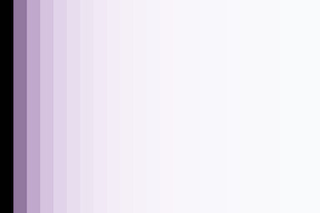 | Baseline ramp — no effect, no mask. The unmodified target. |
|  | expo+1.0 with no mask — uniform brightening everywhere. The "fully on" reference. |

Per-shape renders:

| Phrase | Notes | Render |
|-|-|-|
| "Bottom third" (gradient) | anchor_y=0.67, rotation=180. Light side covers bottom 1/3. | 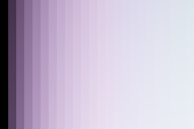 |
| "Top half" (gradient) | anchor_y=0.5, rotation=0. Light side covers top half. | 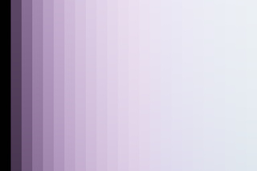 |
| "Left half" (gradient) | rotation=90, vertical axis. Light side covers left half. |  |
| "Right half" (gradient) | rotation=270, vertical axis. Light side covers right half. | 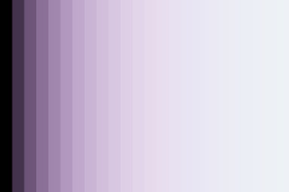 |
| "Bottom third (hard edge)" (rectangle) | x0=0, y0=0.67, x1=1, y1=1. Hard-edged bottom 1/3. | 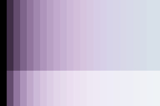 |
| "Center square" (rectangle) | 50% x 50% center square with subtle feathering. | 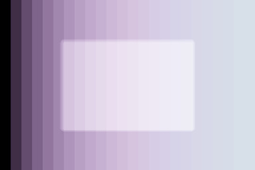 |
| "Center circle, medium" (ellipse) | center=(0.5, 0.5), radius=0.3, border=0.08. | 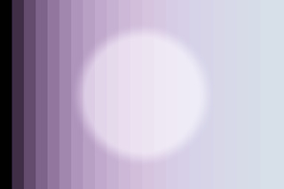 |
| "Subject upper-left rule-of-thirds" (ellipse) | center=(0.33, 0.33), radius=0.2 - subject region at top-left intersection. | 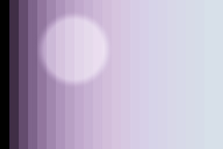 |
| "Diagonal, top-left dim" (gradient, light bottom-right) | rotation=225, diagonal axis. Light side bottom-right. | 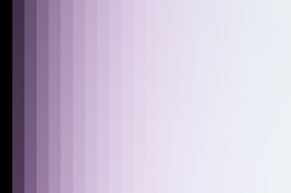 |
| Centered triangle (path) | 3-vertex closed polygon. RFC-026 substrate; same wire AI subject masks will use. | 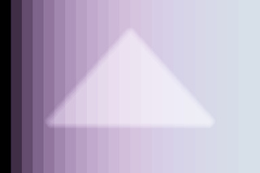 |
| Parametric only: "all dark pixels" (luminance shadows) | range_filter only (no dt_form). Affects the dark third of the tonal range anywhere in the image. |  |
| Parametric only: "all bright pixels" (luminance highlights) | range_filter only. Affects the upper third of the tonal range — useful for highlight recovery / dampening. |  |
| Inverted: "everything except shadows" | range_filter with invert=true. Same shadow band, but pixels OUTSIDE that band get the mask (= midtones + highlights). | 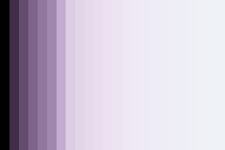 |
| Drawn + parametric: "shadows in the bottom half" | Drawn gradient (bottom half) + luminance shadows filter. Edit applies only where BOTH conditions are true: pixel is in bottom half AND pixel is dark. The user's mental model of refining a drawn mask down to specific pixels. | 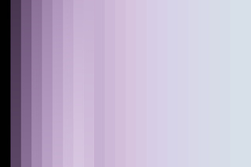 |
| Drawn + parametric: "highlights inside subject ellipse" | Drawn ellipse + luminance highlights filter. Brightens only the bright pixels inside the subject region — useful for catching catchlights without blowing out the midtones. | 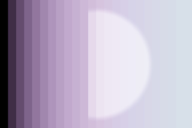 |

These renders are produced by `scripts/generate-mask-shapes-gallery.py`. Refresh after changing the spec table above; CI does not regenerate them automatically.

## See also

- [**Mask-applicable controls**](mask-applicable-controls.md) — which vocabulary primitive can be applied through a mask
- [**Authoring vocabulary entries**](authoring-vocabulary-entries.md) — for permanently baking a mask + primitive composition into the manifest
- ADR-076 (drawn-mask only architecture)
- ADR-084 (apply-time mask spec semantics; closes RFC-029)
- RFC-026 (AI mask provider scaffolding; how AI subject detection produces path-form masks)
- `src/chemigram/core/masking/dt_serialize.py` (the wire encoder for all four shapes)
