# Visual proofs — vocabulary-entry before/after gallery

> Side-by-side renders of the synthetic ColorChecker chart and the synthetic grayscale ramp, before and after each vocabulary entry. For human visual validation: does each primitive *visibly* do what its description claims?

> Renders use an **empty-history baseline** + ``--apply-custom-presets false`` so the chart passes through the darktable pipeline cleanly (input profile → output profile only, no scene-referred tone mapping). Each primitive is then applied in isolation — the only difference between baseline and per-entry renders is *that primitive's effect*. This lets you eyeball each primitive against the reference chart and verify it does what its description claims.

> Production raw renders use the full ``_baseline_v1.xmp`` with sigmoid + colorbalancergb defaults — that path is correct for raws. The empty-baseline trick is specifically for chart-input isolation testing; it would not be appropriate for editing real photographs.

> **Masked columns**: every non-mask-bound primitive renders additionally through a centered ellipse mask (``radius=0.2``, ``border=0.05``) so you can see the spatial shaping in action. The mask covers the middle 16% of the frame; anything outside it should remain at baseline. This visually demonstrates that **any** primitive can be applied through a mask — see [`mask-applicable-controls.md`](mask-applicable-controls.md) for the per-module compatibility matrix.

> **Auto-generated.** Regenerate via ``uv run python scripts/generate-visual-proofs.py`` after vocabulary changes. Commit the regenerated images alongside any vocabulary commit so the gallery and the manifest stay in sync.

> Render size: 400x400, JPEG quality default. Inputs: synthetic targets from [`tests/fixtures/reference-targets/`](../../tests/fixtures/reference-targets/README.md).

---

## Baseline reference

These are the reference targets rendered through the baseline XMP with no primitive applied — the *before* state every row below compares against.

| ColorChecker | Grayscale ramp |
|-|-|
|  |  |

---

## `starter` pack (4 entries)

### `expo_+0.5`

_Lift exposure +0.5 EV._

| ColorChecker (global) | Grayscale (global) | ColorChecker (centered ellipse mask) | Grayscale (centered ellipse mask) |
|-|-|-|-|
|  |  | 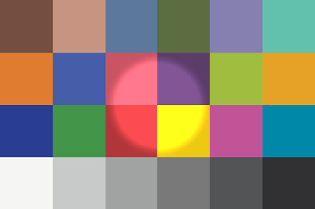 | 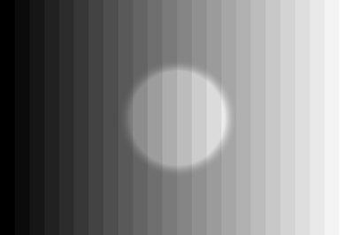 |

### `expo_-0.5`

_Lower exposure -0.5 EV._

| ColorChecker (global) | Grayscale (global) | ColorChecker (centered ellipse mask) | Grayscale (centered ellipse mask) |
|-|-|-|-|
|  |  | 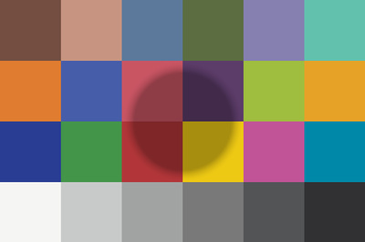 | 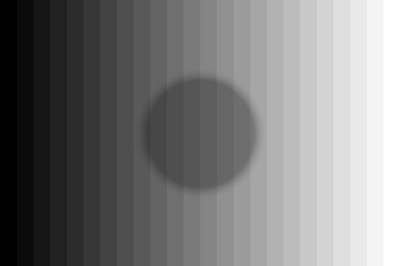 |

### `wb_warm_subtle`

_Warm white balance, subtle._

| ColorChecker (global) | Grayscale (global) | ColorChecker (centered ellipse mask) | Grayscale (centered ellipse mask) |
|-|-|-|-|
|  |  |  |  |

### `look_neutral`

_Neutral L2 look — exposure + warm-subtle WB baseline._

| ColorChecker (global) | Grayscale (global) | ColorChecker (centered ellipse mask) | Grayscale (centered ellipse mask) |
|-|-|-|-|
|  |  | 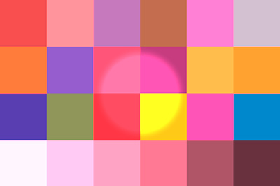 | 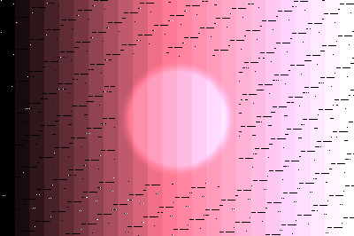 |

---

## `expressive-baseline` pack (35 entries)

### `grain_fine`

_Subtle film-grain texture; strength 8/100._

| ColorChecker (global) | Grayscale (global) | ColorChecker (centered ellipse mask) | Grayscale (centered ellipse mask) |
|-|-|-|-|
|  |  | 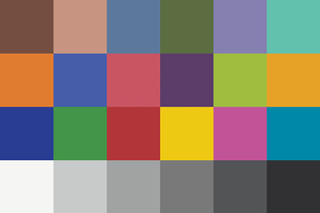 | 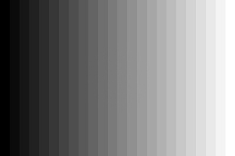 |

### `grain_medium`

_Visible film-grain texture; strength 25/100._

| ColorChecker (global) | Grayscale (global) | ColorChecker (centered ellipse mask) | Grayscale (centered ellipse mask) |
|-|-|-|-|
|  |  |  | 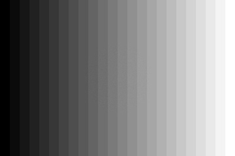 |

### `grain_heavy`

_Heavy film-grain texture; strength 50/100, coarser scale._

| ColorChecker (global) | Grayscale (global) | ColorChecker (centered ellipse mask) | Grayscale (centered ellipse mask) |
|-|-|-|-|
|  |  |  | 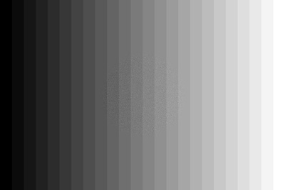 |

### `vignette_subtle`

_Subtle corner darkening; brightness -0.25._

| ColorChecker (global) | Grayscale (global) | ColorChecker (centered ellipse mask) | Grayscale (centered ellipse mask) |
|-|-|-|-|
|  |  |  | 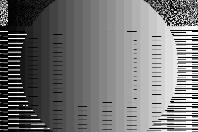 |

### `vignette_medium`

_Medium corner darkening; brightness -0.5._

| ColorChecker (global) | Grayscale (global) | ColorChecker (centered ellipse mask) | Grayscale (centered ellipse mask) |
|-|-|-|-|
|  |  |  |  |

### `vignette_heavy`

_Strong corner darkening; brightness -0.8._

| ColorChecker (global) | Grayscale (global) | ColorChecker (centered ellipse mask) | Grayscale (centered ellipse mask) |
|-|-|-|-|
|  |  |  |  |

### `highlights_recovery_subtle`

_Subtle highlight reconstruction; clip 0.95._

| ColorChecker (global) | Grayscale (global) | ColorChecker (centered ellipse mask) | Grayscale (centered ellipse mask) |
|-|-|-|-|
|  |  | 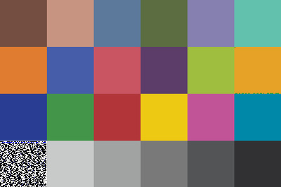 |  |

### `highlights_recovery_strong`

_Strong highlight reconstruction; clip 0.85._

| ColorChecker (global) | Grayscale (global) | ColorChecker (centered ellipse mask) | Grayscale (centered ellipse mask) |
|-|-|-|-|
|  |  |  |  |

### `contrast_low`

_Mild s-curve; sigmoid contrast 1.0._

| ColorChecker (global) | Grayscale (global) | ColorChecker (centered ellipse mask) | Grayscale (centered ellipse mask) |
|-|-|-|-|
|  |  | 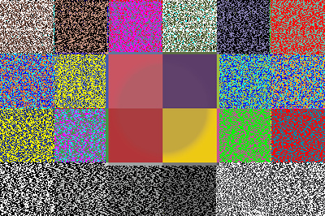 | 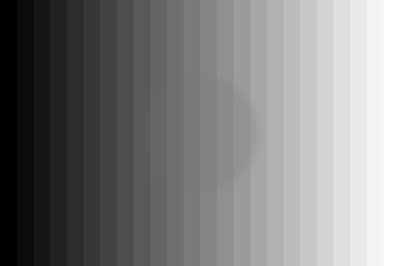 |

### `contrast_high`

_Aggressive s-curve; sigmoid contrast 2.5._

| ColorChecker (global) | Grayscale (global) | ColorChecker (centered ellipse mask) | Grayscale (centered ellipse mask) |
|-|-|-|-|
|  |  | 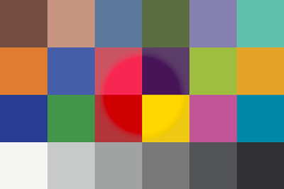 | 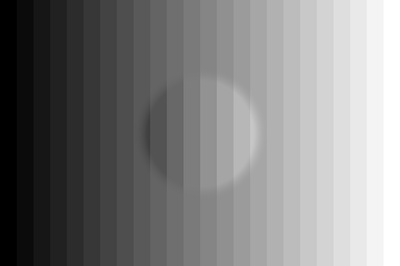 |

### `blacks_lifted`

_Lift target black to 0.5._

| ColorChecker (global) | Grayscale (global) | ColorChecker (centered ellipse mask) | Grayscale (centered ellipse mask) |
|-|-|-|-|
|  |  | 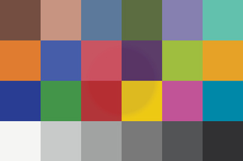 | 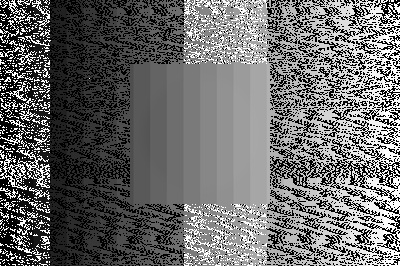 |

### `blacks_crushed`

_Crush blacks: target 0.001 + skew -0.3._

| ColorChecker (global) | Grayscale (global) | ColorChecker (centered ellipse mask) | Grayscale (centered ellipse mask) |
|-|-|-|-|
|  |  | 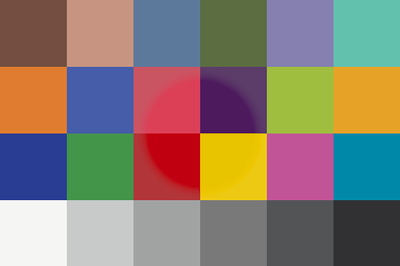 | 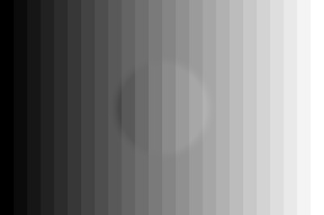 |

### `whites_open`

_Open whites: target 300 (3x default)._

| ColorChecker (global) | Grayscale (global) | ColorChecker (centered ellipse mask) | Grayscale (centered ellipse mask) |
|-|-|-|-|
|  |  | 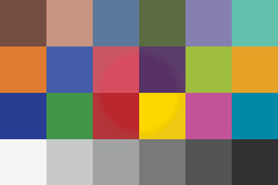 | 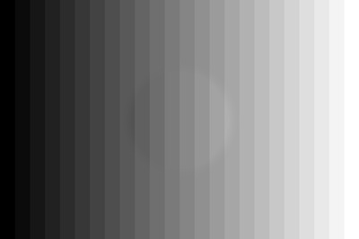 |

### `clarity_strong`

_Strong local contrast / clarity (detail 1.5)._

| ColorChecker (global) | Grayscale (global) | ColorChecker (centered ellipse mask) | Grayscale (centered ellipse mask) |
|-|-|-|-|
|  |  | 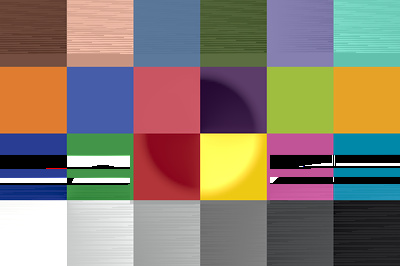 | 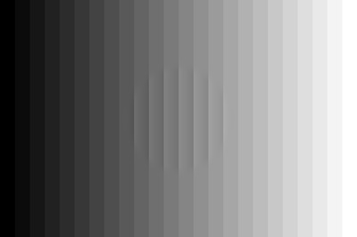 |

### `clarity_painterly`

_Soft painterly local contrast (detail 0.4)._

| ColorChecker (global) | Grayscale (global) | ColorChecker (centered ellipse mask) | Grayscale (centered ellipse mask) |
|-|-|-|-|
|  |  | 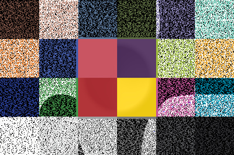 | 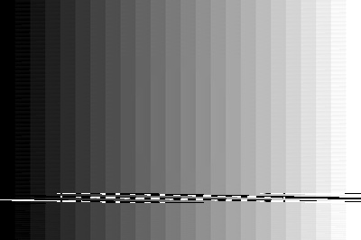 |

### `expo_+0.3`

_Lift exposure +0.3 EV (smaller than starter +0.5)._

| ColorChecker (global) | Grayscale (global) | ColorChecker (centered ellipse mask) | Grayscale (centered ellipse mask) |
|-|-|-|-|
|  |  | 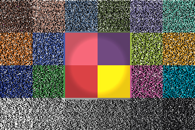 |  |

### `expo_-0.3`

_Lower exposure -0.3 EV (smaller than starter -0.5)._

| ColorChecker (global) | Grayscale (global) | ColorChecker (centered ellipse mask) | Grayscale (centered ellipse mask) |
|-|-|-|-|
|  |  | 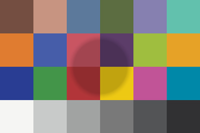 | 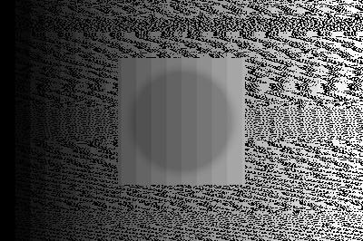 |

### `shadows_global_+`

_Lift global black level +0.05._

| ColorChecker (global) | Grayscale (global) | ColorChecker (centered ellipse mask) | Grayscale (centered ellipse mask) |
|-|-|-|-|
|  |  | 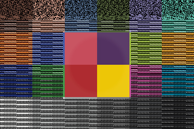 | 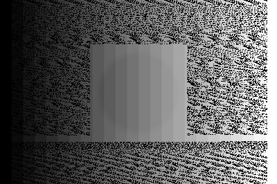 |

### `shadows_global_-`

_Lower global black level -0.05 (deepen shadows)._

| ColorChecker (global) | Grayscale (global) | ColorChecker (centered ellipse mask) | Grayscale (centered ellipse mask) |
|-|-|-|-|
|  |  | 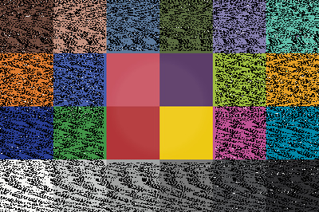 | 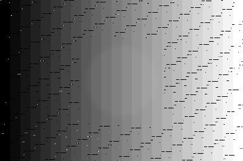 |

### `wb_cool_subtle`

_Cool white balance, subtle (mirror of wb_warm_subtle)._

| ColorChecker (global) | Grayscale (global) | ColorChecker (centered ellipse mask) | Grayscale (centered ellipse mask) |
|-|-|-|-|
|  |  | 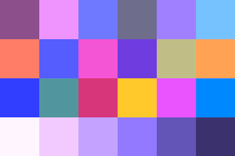 | 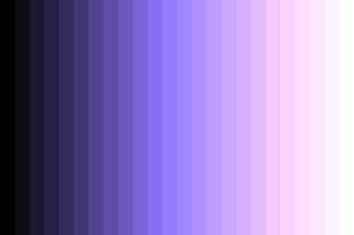 |

### `sat_boost_strong`

_Strong global saturation boost (+0.5)._

| ColorChecker (global) | Grayscale (global) | ColorChecker (centered ellipse mask) | Grayscale (centered ellipse mask) |
|-|-|-|-|
|  |  | 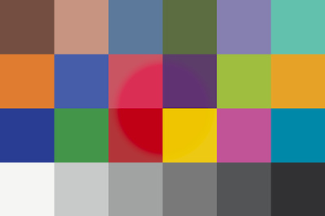 |  |

### `sat_boost_moderate`

_Moderate global saturation boost (+0.25)._

| ColorChecker (global) | Grayscale (global) | ColorChecker (centered ellipse mask) | Grayscale (centered ellipse mask) |
|-|-|-|-|
|  |  | 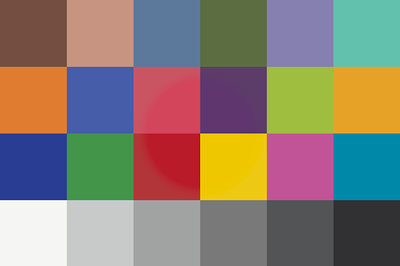 |  |

### `sat_kill`

_Kill all saturation (global -1.0)._

| ColorChecker (global) | Grayscale (global) | ColorChecker (centered ellipse mask) | Grayscale (centered ellipse mask) |
|-|-|-|-|
|  |  | 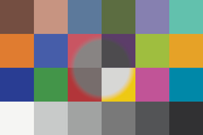 | 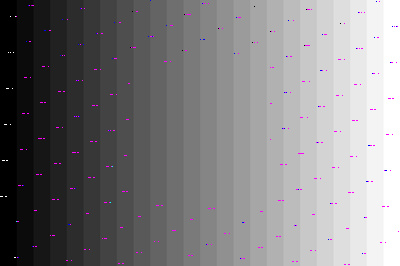 |

### `vibrance_+0.3`

_Global vibrance +0.3._

| ColorChecker (global) | Grayscale (global) | ColorChecker (centered ellipse mask) | Grayscale (centered ellipse mask) |
|-|-|-|-|
|  |  | 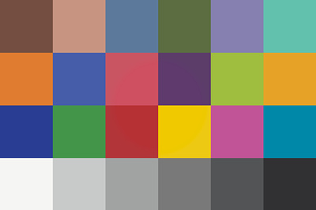 |  |

### `grade_shadows_warm`

_Warm shadows (orange tint, hue 30 deg, chroma 0.3)._

| ColorChecker (global) | Grayscale (global) | ColorChecker (centered ellipse mask) | Grayscale (centered ellipse mask) |
|-|-|-|-|
|  |  | 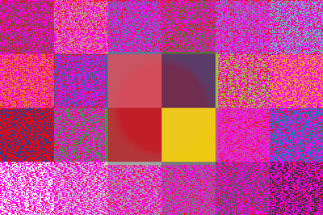 | 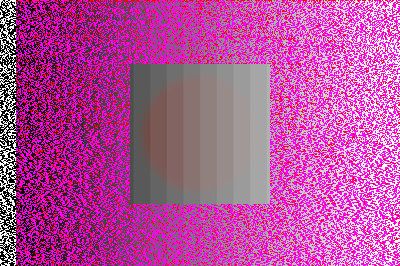 |

### `grade_shadows_cool`

_Cool shadows (blue tint, hue 210 deg, chroma 0.3)._

| ColorChecker (global) | Grayscale (global) | ColorChecker (centered ellipse mask) | Grayscale (centered ellipse mask) |
|-|-|-|-|
|  |  | 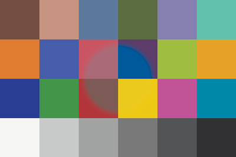 | 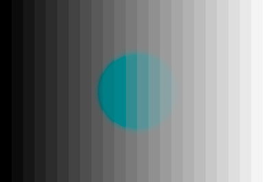 |

### `grade_highlights_warm`

_Warm highlights (orange tint, hue 45 deg, chroma 0.2)._

| ColorChecker (global) | Grayscale (global) | ColorChecker (centered ellipse mask) | Grayscale (centered ellipse mask) |
|-|-|-|-|
|  |  | 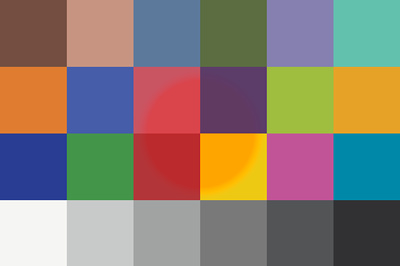 | 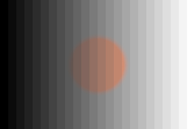 |

### `grade_highlights_cool`

_Cool highlights (blue tint, hue 200 deg, chroma 0.2)._

| ColorChecker (global) | Grayscale (global) | ColorChecker (centered ellipse mask) | Grayscale (centered ellipse mask) |
|-|-|-|-|
|  |  | 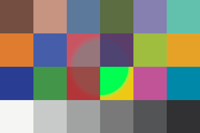 | 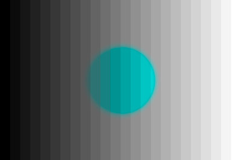 |

### `chroma_boost_shadows`

_Boost shadow chroma +0.3._

| ColorChecker (global) | Grayscale (global) | ColorChecker (centered ellipse mask) | Grayscale (centered ellipse mask) |
|-|-|-|-|
|  |  |  | 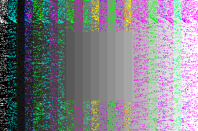 |

### `chroma_boost_midtones`

_Boost mid-tone chroma +0.3._

| ColorChecker (global) | Grayscale (global) | ColorChecker (centered ellipse mask) | Grayscale (centered ellipse mask) |
|-|-|-|-|
|  |  | 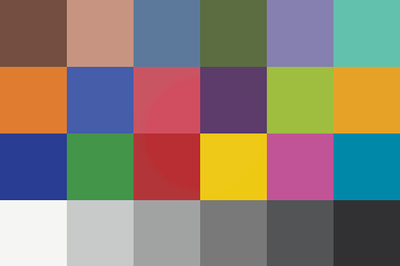 |  |

### `chroma_boost_highlights`

_Boost highlight chroma +0.3._

| ColorChecker (global) | Grayscale (global) | ColorChecker (centered ellipse mask) | Grayscale (centered ellipse mask) |
|-|-|-|-|
|  |  |  |  |

### `gradient_top_dampen_highlights` 🟦 mask-bound

_Dampen top-half highlights via -0.5 EV through a top-bright gradient._

| ColorChecker | Grayscale ramp |
|-|-|
|  |  |

### `gradient_bottom_lift_shadows` 🟦 mask-bound

_Lift bottom-half shadows via +0.4 EV through a bottom-bright gradient._

| ColorChecker | Grayscale ramp |
|-|-|
|  |  |

### `radial_subject_lift` 🟦 mask-bound

_Lift +0.6 EV in a centered radial mask region (subject emphasis)._

| ColorChecker | Grayscale ramp |
|-|-|
|  |  |

### `rectangle_subject_band_dim` 🟦 mask-bound

_Dim -0.3 EV in a horizontal mid-band rectangle (de-emphasize a horizon line)._

| ColorChecker | Grayscale ramp |
|-|-|
|  |  |

---

## Notes

- **Inputs are sRGB PNGs**, not raw files. darktable processes them through its non-raw path — input color profile applies, demosaic does not. Some primitives (e.g., raw-aware white-balance moves) behave differently from how they would on a real raw. The gallery is for *visual response validation*, not pipeline calibration; for raw-pipeline direction-of-change validation see the e2e suite in [`tests/e2e/`](../../tests/e2e/).

- **Mask-bound entries** (gradient/ellipse/rectangle, marked 🟦 above) route through the drawn-mask apply path per ADR-076. The mask geometry encodes into the XMP's `masks_history`; you see the spatial shaping in the rendered chart.

- **Out-of-gamut patches** on the ColorChecker (notably patch #18 Cyan) clip to nearest in-gamut sRGB; that clipping is in the input, not the primitive. See [`reference-targets/README.md`](../../tests/fixtures/reference-targets/README.md).
