# Visual proofs — vocabulary-entry before/after gallery

> Side-by-side renders of the synthetic ColorChecker chart and the synthetic grayscale ramp, before and after each vocabulary entry. For human visual validation: does each primitive *visibly* do what its description claims?

> Renders use an **empty-history baseline** + ``--apply-custom-presets false`` so the chart passes through the darktable pipeline cleanly (input profile → output profile only, no scene-referred tone mapping). Each primitive is then applied in isolation — the only difference between baseline and per-entry renders is *that primitive's effect*. This lets you eyeball each primitive against the reference chart and verify it does what its description claims.

> Production raw renders use the full ``_baseline_v1.xmp`` with sigmoid + colorbalancergb defaults — that path is correct for raws. The empty-baseline trick is specifically for chart-input isolation testing; it would not be appropriate for editing real photographs.

> **Masked columns**: every non-mask-bound primitive renders additionally through a centered ellipse mask (``radius=0.2``, ``border=0.05``) so you can see the spatial shaping in action. The mask covers the middle 16% of the frame; anything outside it should remain at baseline. This visually demonstrates that **any** primitive can be applied through a mask — see [`mask-applicable-controls.md`](mask-applicable-controls.md) for the per-module compatibility matrix.

> **Auto-generated.** Regenerate via ``uv run python scripts/generate-visual-proofs.py`` after vocabulary changes. Commit the regenerated images alongside any vocabulary commit so the gallery and the manifest stay in sync.

> Render size: 400x400, JPEG quality default. Inputs: synthetic targets from [`tests/fixtures/reference-targets/`](https://github.com/chipi/chemigram/blob/main/tests/fixtures/reference-targets/README.md).

> **🚫 Real-raw fixture missing (#103).** A small set of entries (currently HSL via `colorequal`) need a real raw for visual proof — the synthetic chart pipeline produces degenerate output. Those entries currently show a documented placeholder row; drop a fixture file at the path defined by `REAL_RAW_FIXTURE` in this script (see [`tests/fixtures/raws/README.md`](https://github.com/chipi/chemigram/blob/main/tests/fixtures/raws/README.md)) to enable real-raw rendering.

---

## Baseline reference

These are the reference targets rendered through the baseline XMP with no primitive applied — the *before* state every row below compares against.

| ColorChecker | Grayscale ramp |
|-|-|
|  |  |

---

## `starter` pack (2 entries)

### `wb_warm_subtle`

_Warm white balance, subtle._

| ColorChecker (global) | Grayscale (global) |
|-|-|
|  |  |

> 🚫 **Masked variant suppressed**: see [mask-applicable-controls](mask-applicable-controls.md#temperature) for why drawn-mask binding doesn't render usefully for this module.

### `look_neutral`

_Neutral L2 look — exposure + warm-subtle WB baseline._

| ColorChecker (global) | Grayscale (global) | ColorChecker (centered ellipse mask) | Grayscale (centered ellipse mask) |
|-|-|-|-|
|  |  |  |  |

---

## `expressive-baseline` pack (69 entries)

### `grain_strength`

_Parameterized grain strength (RFC-021). Pass --value V; range [0.0, 100.0]. 8 = grain_fine-equivalent, 25 = grain_medium-equivalent, 50 = grain_heavy-equivalent. Replaces the v1.5.x discrete grain_fine / grain_medium / grain_heavy entries with a single continuous-magnitude primitive._

| ColorChecker (global) | Grayscale (global) | ColorChecker (centered ellipse mask) | Grayscale (centered ellipse mask) |
|-|-|-|-|
|  |  |  |  |

_(near-baseline diff in ColorChecker (global): grain texture is hard to see on flat chart patches — see the **clipped-gradient row below** for visible texture, or [mask-applicable-controls](mask-applicable-controls.md#grain))_

_(near-baseline diff in grayscale (global): grain texture is hard to see on flat chart patches — see the **clipped-gradient row below** for visible texture, or [mask-applicable-controls](mask-applicable-controls.md#grain))_

_(near-baseline diff in ColorChecker (masked): grain texture is hard to see on flat chart patches — see the **clipped-gradient row below** for visible texture, or [mask-applicable-controls](mask-applicable-controls.md#grain))_

**On the clipped-gradient fixture** (continuous tone + blown highlights — chart designed to show this module's effect; see [`reference-targets/README.md`](https://github.com/chipi/chemigram/blob/main/tests/fixtures/reference-targets/README.md)):

| Clipped gradient (global) | Clipped gradient (centered ellipse mask) |
|-|-|
|  |  |

**Parameter sweep** (`grain_strength`): rendered at multiple values via the parameterized apply path (`--value V` / `--param NAME=V`); other parameterized axes (if any) held at their dtstyle defaults.

| `0.00` | `+8.00` | `+25.00` | `+50.00` | `+100.00` |
|-|-|-|-|-|
|  |  |  | 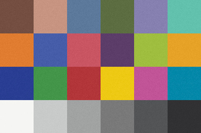 |  |

### `vignette`

_Parameterized vignette (RFC-021). Pass --value V (CLI) or value: V (MCP); range [-1.0, +1.0] (negative darkens corners; positive lifts). Replaces the v1.5.x discrete vignette_subtle / vignette_medium / vignette_heavy entries with a single continuous-magnitude primitive._

| ColorChecker (global) | Grayscale (global) |
|-|-|
|  |  |

> 🚫 **Masked variant suppressed**: see [mask-applicable-controls](mask-applicable-controls.md#vignette) for why drawn-mask binding doesn't render usefully for this module.

_(near-baseline diff in ColorChecker (global): subtle vignette is small at the modest gallery render size; effect is concentrated at the very corners of the frame)_

_(near-baseline diff in grayscale (global): subtle vignette is small at the modest gallery render size; effect is concentrated at the very corners of the frame)_

**Parameter sweep** (`brightness`): rendered at multiple values via the parameterized apply path (`--value V` / `--param NAME=V`); other parameterized axes (if any) held at their dtstyle defaults.

| `-0.80` | `-0.50` | `-0.25` | `0.00` |
|-|-|-|-|
|  |  | 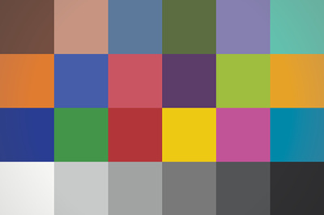 | 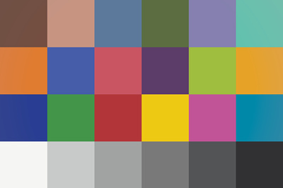 |

### `highlights_clip_threshold`

_Parameterized highlight-recovery clip threshold (RFC-021). Pass --value V; range [0.0, 2.0]: lower = more aggressive recovery (0.95 = subtle, 0.85 = strong, 0.5 = aggressive). Default 1.0 (darktable default; recovers only above 1.0). Replaces the v1.5.x discrete highlights_recovery_subtle / highlights_recovery_strong entries._

| ColorChecker (global) | Grayscale (global) | ColorChecker (centered ellipse mask) | Grayscale (centered ellipse mask) |
|-|-|-|-|
|  |  |  |  |

_(near-baseline diff in ColorChecker (global): this chart has no blown highlights to recover — see the **clipped-gradient row below** for the visible effect, or [mask-applicable-controls](mask-applicable-controls.md#highlights))_

_(near-baseline diff in grayscale (global): this chart has no blown highlights to recover — see the **clipped-gradient row below** for the visible effect, or [mask-applicable-controls](mask-applicable-controls.md#highlights))_

_(near-baseline diff in ColorChecker (masked): this chart has no blown highlights to recover — see the **clipped-gradient row below** for the visible effect, or [mask-applicable-controls](mask-applicable-controls.md#highlights))_

_(near-baseline diff in grayscale (masked): this chart has no blown highlights to recover — see the **clipped-gradient row below** for the visible effect, or [mask-applicable-controls](mask-applicable-controls.md#highlights))_

**On the clipped-gradient fixture** (continuous tone + blown highlights — chart designed to show this module's effect; see [`reference-targets/README.md`](https://github.com/chipi/chemigram/blob/main/tests/fixtures/reference-targets/README.md)):

| Clipped gradient (global) | Clipped gradient (centered ellipse mask) |
|-|-|
|  |  |

**Parameter sweep** (`clip_threshold`): rendered at multiple values via the parameterized apply path (`--value V` / `--param NAME=V`); other parameterized axes (if any) held at their dtstyle defaults.

| `+0.50` | `+0.85` | `+0.95` | `+1.00` | `+1.50` |
|-|-|-|-|-|
|  |  |  |  |  |

### `sigmoid_contrast`

_Parameterized sigmoid tone-curve contrast (RFC-021). Pass --value V (CLI) or value: V (MCP); range [0.5, 5.0] (1.0 = mild s-curve, 1.5 = darktable default / no curve change, 2.5 = aggressive s-curve). Replaces the v1.5.x discrete contrast_low / contrast_high entries with a single continuous-magnitude primitive._

| ColorChecker (global) | Grayscale (global) | ColorChecker (centered ellipse mask) | Grayscale (centered ellipse mask) |
|-|-|-|-|
|  |  |  |  |

**Parameter sweep** (`contrast`): rendered at multiple values via the parameterized apply path (`--value V` / `--param NAME=V`); other parameterized axes (if any) held at their dtstyle defaults.

| `+0.50` | `+1.00` | `+1.50` | `+2.00` | `+2.50` |
|-|-|-|-|-|
| 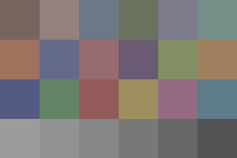 |  |  |  |  |

### `blacks_lifted`

_Lift target black to 0.5._

| ColorChecker (global) | Grayscale (global) | ColorChecker (centered ellipse mask) | Grayscale (centered ellipse mask) |
|-|-|-|-|
|  |  |  |  |

### `blacks_crushed`

_Crush blacks: target 0.001 + skew -0.3._

| ColorChecker (global) | Grayscale (global) | ColorChecker (centered ellipse mask) | Grayscale (centered ellipse mask) |
|-|-|-|-|
|  |  |  |  |

### `whites_open`

_Open whites: target 300 (3x default)._

| ColorChecker (global) | Grayscale (global) | ColorChecker (centered ellipse mask) | Grayscale (centered ellipse mask) |
|-|-|-|-|
|  |  |  |  |

### `bw_convert`

_Neutral B&W conversion via channelmixerrgb (Rec. 709 luminance weights: R 0.2126, G 0.7152, B 0.0722). normalize_grey=true so weights sum-normalize. Closes the v1.4.0 milestone B&W trio (#63)._

| ColorChecker (global) | Grayscale (global) | ColorChecker (centered ellipse mask) | Grayscale (centered ellipse mask) |
|-|-|-|-|
| 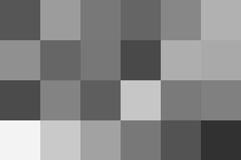 | 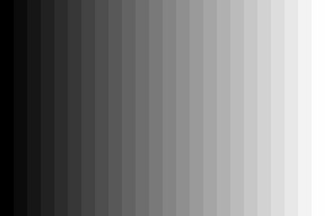 | 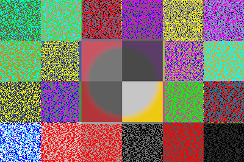 | 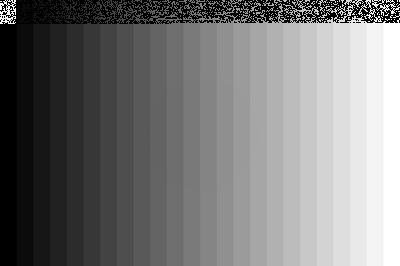 |

_(near-baseline diff in grayscale (global): below visible threshold on this chart input)_

### `bw_sky_drama`

_B&W with sky-drama mix (red-emphasis: R 0.5 / G 0.4 / B 0.1). Lightens reds and darkens blues — classic 'red filter' landscape look that emphasizes clouds against sky. normalize_grey=true._

| ColorChecker (global) | Grayscale (global) | ColorChecker (centered ellipse mask) | Grayscale (centered ellipse mask) |
|-|-|-|-|
| 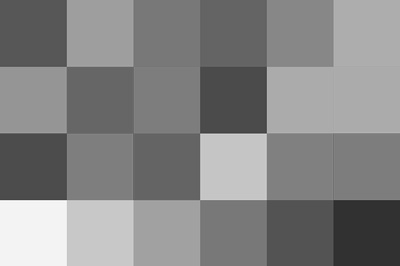 |  | 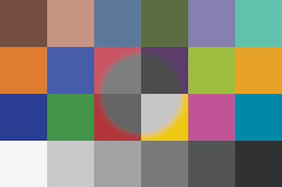 | 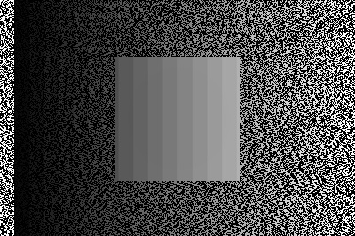 |

_(near-baseline diff in grayscale (global): below visible threshold on this chart input)_

### `bw_foliage`

_B&W with foliage mix (green-emphasis: R 0.1 / G 0.7 / B 0.2). Lightens greens — separates foliage from neighboring tones; useful for forest / botanical work where green is the dominant subject. normalize_grey=true._

| ColorChecker (global) | Grayscale (global) | ColorChecker (centered ellipse mask) | Grayscale (centered ellipse mask) |
|-|-|-|-|
| 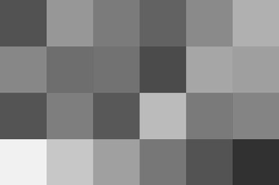 |  | 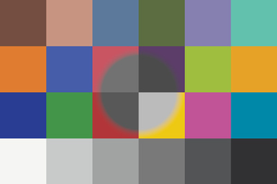 | 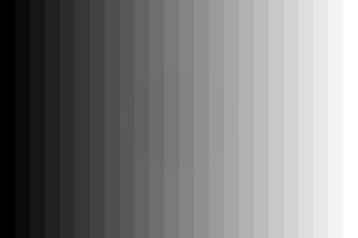 |

_(near-baseline diff in grayscale (global): below visible threshold on this chart input)_

_(near-baseline diff in grayscale (masked): below visible threshold on this chart input)_

### `toneequalizer`

_Parameterized 9-band tone equalizer (RFC-022 Tier 2; most complex multi-parameter ship). Pass --param NODE=V for any of: noise, ultra_deep_blacks, deep_blacks, blacks, shadows, midtones, highlights, whites, speculars. Each in [-2.0, +2.0] EV; default 0.0. Algorithm fields preserved at darktable defaults._

| ColorChecker (global) | Grayscale (global) | ColorChecker (centered ellipse mask) | Grayscale (centered ellipse mask) |
|-|-|-|-|
|  |  | 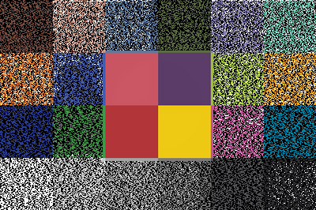 | 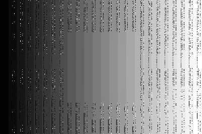 |

_(near-baseline diff in ColorChecker (global): below visible threshold on this chart input)_

_(near-baseline diff in grayscale (global): below visible threshold on this chart input)_

**Parameter sweep** (`noise`): rendered at multiple values via the parameterized apply path (`--value V` / `--param NAME=V`); other parameterized axes (if any) held at their dtstyle defaults.

| `-1.50` | `-0.50` | `0.00` | `+0.50` | `+1.50` |
|-|-|-|-|-|
|  | 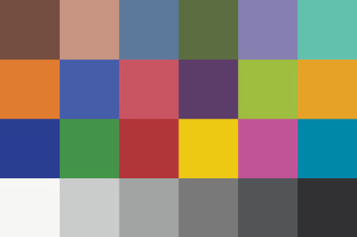 |  | 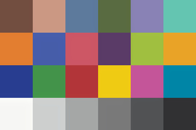 |  |

**Parameter sweep** (`ultra_deep_blacks`): rendered at multiple values via the parameterized apply path (`--value V` / `--param NAME=V`); other parameterized axes (if any) held at their dtstyle defaults.

| `-1.50` | `-0.50` | `0.00` | `+0.50` | `+1.50` |
|-|-|-|-|-|
| 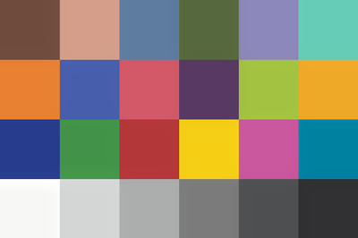 |  | 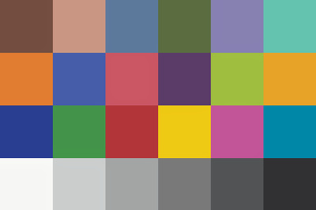 | 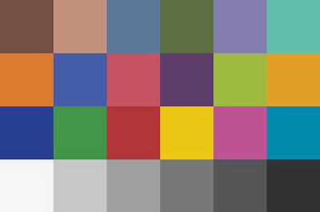 | 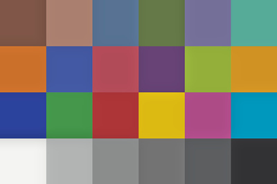 |

**Parameter sweep** (`deep_blacks`): rendered at multiple values via the parameterized apply path (`--value V` / `--param NAME=V`); other parameterized axes (if any) held at their dtstyle defaults.

| `-1.50` | `-0.50` | `0.00` | `+0.50` | `+1.50` |
|-|-|-|-|-|
| 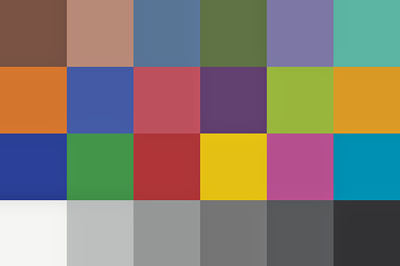 | 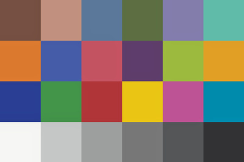 |  | 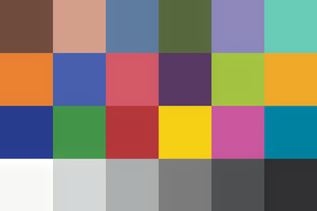 | 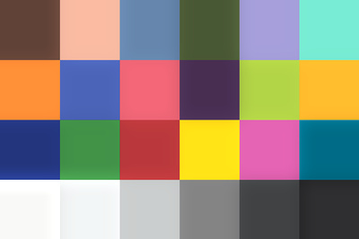 |

**Parameter sweep** (`blacks`): rendered at multiple values via the parameterized apply path (`--value V` / `--param NAME=V`); other parameterized axes (if any) held at their dtstyle defaults.

| `-1.50` | `-0.50` | `0.00` | `+0.50` | `+1.50` |
|-|-|-|-|-|
| 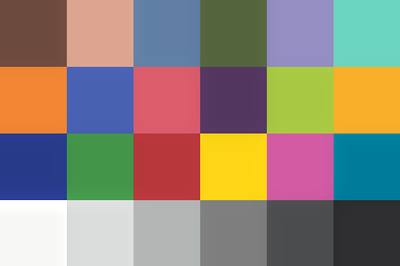 | 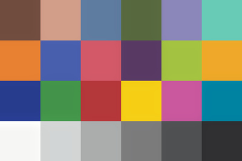 |  | 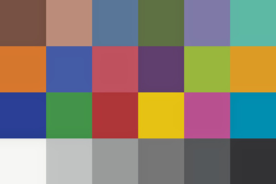 | 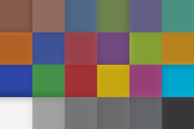 |

**Parameter sweep** (`shadows`): rendered at multiple values via the parameterized apply path (`--value V` / `--param NAME=V`); other parameterized axes (if any) held at their dtstyle defaults.

| `-1.50` | `-0.50` | `0.00` | `+0.50` | `+1.50` |
|-|-|-|-|-|
| 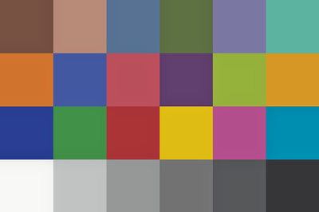 | 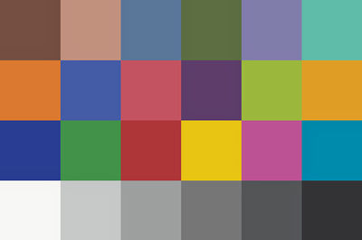 |  | 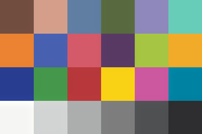 | 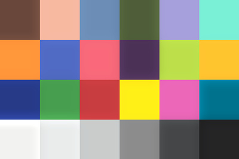 |

**Parameter sweep** (`midtones`): rendered at multiple values via the parameterized apply path (`--value V` / `--param NAME=V`); other parameterized axes (if any) held at their dtstyle defaults.

| `-1.50` | `-0.50` | `0.00` | `+0.50` | `+1.50` |
|-|-|-|-|-|
| 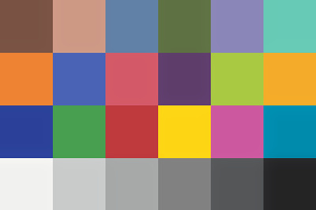 |  |  | 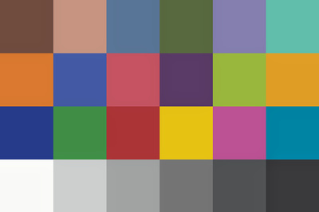 |  |

**Parameter sweep** (`highlights`): rendered at multiple values via the parameterized apply path (`--value V` / `--param NAME=V`); other parameterized axes (if any) held at their dtstyle defaults.

| `-1.50` | `-0.50` | `0.00` | `+0.50` | `+1.50` |
|-|-|-|-|-|
| 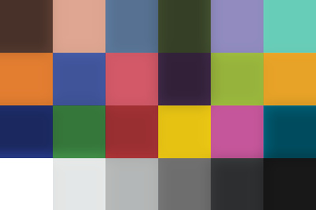 | 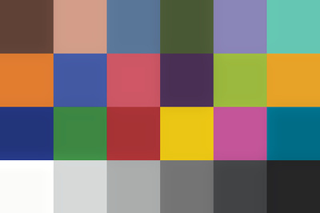 |  | 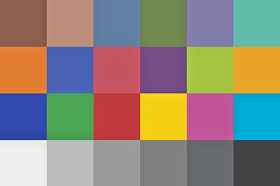 | 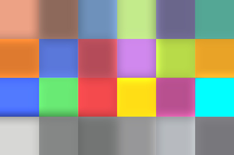 |

**Parameter sweep** (`whites`): rendered at multiple values via the parameterized apply path (`--value V` / `--param NAME=V`); other parameterized axes (if any) held at their dtstyle defaults.

| `-1.50` | `-0.50` | `0.00` | `+0.50` | `+1.50` |
|-|-|-|-|-|
| 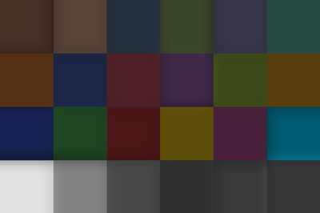 | 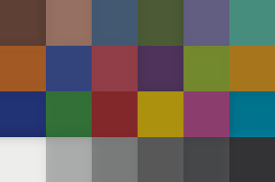 |  | 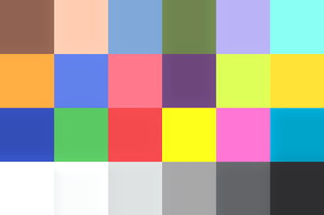 | 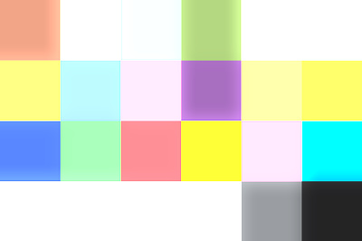 |

**Parameter sweep** (`speculars`): rendered at multiple values via the parameterized apply path (`--value V` / `--param NAME=V`); other parameterized axes (if any) held at their dtstyle defaults.

| `-1.50` | `-0.50` | `0.00` | `+0.50` | `+1.50` |
|-|-|-|-|-|
| 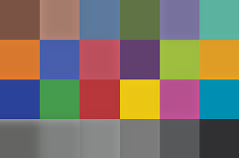 | 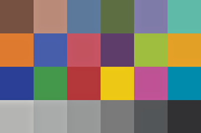 |  | 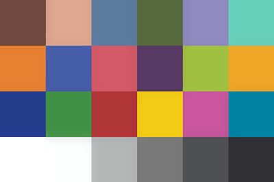 | 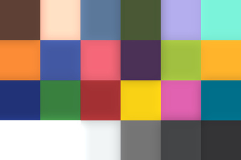 |

### `sharpen`

_Parameterized sharpening (RFC-022 Tier 2). Pass --value V; range [0.0, 2.0] (0.0 = no sharpen, 0.5 = subtle, 1.0 = strong, 2.0 = aggressive). Radius preserved at darktable default 2.0 px, threshold at 0.5._

| ColorChecker (global) | Grayscale (global) | ColorChecker (centered ellipse mask) | Grayscale (centered ellipse mask) |
|-|-|-|-|
|  |  |  | 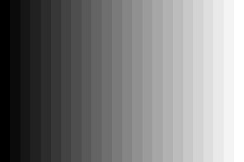 |

_(near-baseline diff in ColorChecker (global): below visible threshold on this chart input)_

_(near-baseline diff in grayscale (global): below visible threshold on this chart input)_

_(near-baseline diff in ColorChecker (masked): below visible threshold on this chart input)_

_(near-baseline diff in grayscale (masked): below visible threshold on this chart input)_

**Parameter sweep** (`amount`): rendered at multiple values via the parameterized apply path (`--value V` / `--param NAME=V`); other parameterized axes (if any) held at their dtstyle defaults.

| `0.00` | `+0.50` | `+1.00` | `+1.50` | `+2.00` |
|-|-|-|-|-|
|  |  |  |  |  |

### `crop`

_Parameterized crop (RFC-022 Tier 2). Pass --param cx=V cy=V cw=V ch=V — each in [0.0, 1.0]. Default 0,0,1,1 (no crop). cx/cy = top-left margin, cw/ch = bottom-right margin (so crop region is [cx..cw] x [cy..ch] in normalized coords). First workflow-primitive parameterized entry; aspect-ratio constraint preserved at -1/-1 (free)._

| ColorChecker (global) | Grayscale (global) | ColorChecker (centered ellipse mask) | Grayscale (centered ellipse mask) |
|-|-|-|-|
|  |  |  |  |

_(near-baseline diff in ColorChecker (global): below visible threshold on this chart input)_

_(near-baseline diff in grayscale (global): below visible threshold on this chart input)_

_(near-baseline diff in ColorChecker (masked): below visible threshold on this chart input)_

_(near-baseline diff in grayscale (masked): below visible threshold on this chart input)_

**Parameter sweep** (`cx`): rendered at multiple values via the parameterized apply path (`--value V` / `--param NAME=V`); other parameterized axes (if any) held at their dtstyle defaults.

| `0.00` | `+0.10` | `+0.20` | `+0.30` |
|-|-|-|-|
|  | 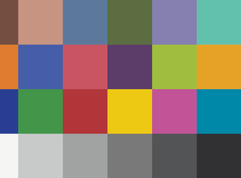 |  |  |

**Parameter sweep** (`cy`): rendered at multiple values via the parameterized apply path (`--value V` / `--param NAME=V`); other parameterized axes (if any) held at their dtstyle defaults.

| `0.00` | `+0.10` | `+0.20` | `+0.30` |
|-|-|-|-|
|  |  |  |  |

**Parameter sweep** (`cw`): rendered at multiple values via the parameterized apply path (`--value V` / `--param NAME=V`); other parameterized axes (if any) held at their dtstyle defaults.

| `+0.70` | `+0.80` | `+0.90` | `+1.00` |
|-|-|-|-|
|  |  |  |  |

**Parameter sweep** (`ch`): rendered at multiple values via the parameterized apply path (`--value V` / `--param NAME=V`); other parameterized axes (if any) held at their dtstyle defaults.

| `+0.70` | `+0.80` | `+0.90` | `+1.00` |
|-|-|-|-|
|  |  |  |  |

### `bilat_clarity_strength`

_Parameterized clarity strength on bilat / local laplacian (RFC-021). Pass --value V; range [-1.0, 4.0]. 1.5 = clarity_strong-equivalent. clarity_painterly stays as a separate discrete entry — different kind, not strength._

| ColorChecker (global) | Grayscale (global) | ColorChecker (centered ellipse mask) | Grayscale (centered ellipse mask) |
|-|-|-|-|
|  |  |  |  |

_(near-baseline diff in ColorChecker (global): below visible threshold on this chart input)_

_(near-baseline diff in grayscale (global): below visible threshold on this chart input)_

_(near-baseline diff in ColorChecker (masked): below visible threshold on this chart input)_

_(near-baseline diff in grayscale (masked): below visible threshold on this chart input)_

**Parameter sweep** (`clarity_strength`): rendered at multiple values via the parameterized apply path (`--value V` / `--param NAME=V`); other parameterized axes (if any) held at their dtstyle defaults.

| `-0.50` | `0.00` | `+0.50` | `+1.50` | `+2.50` |
|-|-|-|-|-|
|  |  |  |  |  |

### `clarity_painterly`

_Soft painterly local contrast (detail 0.4)._

| ColorChecker (global) | Grayscale (global) | ColorChecker (centered ellipse mask) | Grayscale (centered ellipse mask) |
|-|-|-|-|
|  |  |  |  |

### `exposure`

_Parameterized exposure compensation (RFC-021). Pass --value V (CLI) or value: V (MCP) in EV stops; range [-3.0, +3.0]. Replaces the v1.5.x discrete expo_+0.3 / expo_+0.5 / expo_-0.3 / expo_-0.5 / shadows_global_+/- entries with a single continuous-magnitude primitive._

| ColorChecker (global) | Grayscale (global) | ColorChecker (centered ellipse mask) | Grayscale (centered ellipse mask) |
|-|-|-|-|
|  |  |  |  |

_(near-baseline diff in ColorChecker (global): below visible threshold on this chart input)_

_(near-baseline diff in grayscale (global): below visible threshold on this chart input)_

_(near-baseline diff in grayscale (masked): below visible threshold on this chart input)_

**Parameter sweep** (`ev`): rendered at multiple values via the parameterized apply path (`--value V` / `--param NAME=V`); other parameterized axes (if any) held at their dtstyle defaults.

| `-1.00` | `-0.50` | `0.00` | `+0.50` | `+1.00` |
|-|-|-|-|-|
|  |  |  |  |  |

### `transform`

_Parameterized perspective / transform (#101). Closes the Lightroom Transform panel parity gap via darktable's ashift module. 5 magnitude axes: --param transform_rotation=V (image rotation in degrees), --param transform_lensshift_v=V (vertical perspective / keystone), --param transform_lensshift_h=V (horizontal perspective), --param transform_shear=V, --param transform_aspect=V (post-transform aspect adjust; default 1.0). Axis names use transform_ prefix. Lens-tuning floats (focal length, crop factor, ortho-correction) and the user-drawn-lines storage are preserved verbatim — those are darktable-GUI-authored when needed._

| ColorChecker (global) | Grayscale (global) | ColorChecker (centered ellipse mask) | Grayscale (centered ellipse mask) |
|-|-|-|-|
|  |  |  |  |

_(near-baseline diff in ColorChecker (global): below visible threshold on this chart input)_

_(near-baseline diff in grayscale (global): below visible threshold on this chart input)_

_(near-baseline diff in ColorChecker (masked): below visible threshold on this chart input)_

_(near-baseline diff in grayscale (masked): below visible threshold on this chart input)_

**Parameter sweep** (`transform_rotation`): rendered at multiple values via the parameterized apply path (`--value V` / `--param NAME=V`); other parameterized axes (if any) held at their dtstyle defaults.

| `-15.00` | `-5.00` | `0.00` | `+5.00` | `+15.00` |
|-|-|-|-|-|
|  |  |  |  |  |

**Parameter sweep** (`transform_lensshift_v`): rendered at multiple values via the parameterized apply path (`--value V` / `--param NAME=V`); other parameterized axes (if any) held at their dtstyle defaults.

| `-0.50` | `-0.20` | `0.00` | `+0.20` | `+0.50` |
|-|-|-|-|-|
|  |  |  |  |  |

**Parameter sweep** (`transform_lensshift_h`): rendered at multiple values via the parameterized apply path (`--value V` / `--param NAME=V`); other parameterized axes (if any) held at their dtstyle defaults.

| `-0.50` | `-0.20` | `0.00` | `+0.20` | `+0.50` |
|-|-|-|-|-|
|  |  |  |  |  |

**Parameter sweep** (`transform_shear`): rendered at multiple values via the parameterized apply path (`--value V` / `--param NAME=V`); other parameterized axes (if any) held at their dtstyle defaults.

| `-0.30` | `0.00` | `+0.30` |
|-|-|-|
|  |  |  |

**Parameter sweep** (`transform_aspect`): rendered at multiple values via the parameterized apply path (`--value V` / `--param NAME=V`); other parameterized axes (if any) held at their dtstyle defaults.

| `+0.70` | `+0.90` | `+1.00` | `+1.20` | `+1.50` |
|-|-|-|-|-|
|  |  |  |  |  |

### `lens_correction`

_Parameterized lens correction (#95). 10 manual-override magnitude axes via darktable's lens module: --param lens_scale=V (output scaling), --param lens_tca_r=V / lens_tca_b=V (manual TCA shifts; 1.0 = no shift), --param lens_cor_distortion=V / lens_cor_vignette=V / lens_cor_ca_r=V / lens_cor_ca_b=V (per-correction-type strengths for embedded-metadata method), --param lens_v_strength=V / lens_v_radius=V / lens_v_steepness=V (manual vignette correction). NOTE: this entry's photographic effect requires lensfun identifier strings (camera/lens) and shooting metadata (focal/aperture/distance) to be populated. EXIF auto-binding for these is a follow-up; until then, the entry is most useful for overriding strength sliders on a darktable-GUI-authored baseline._

| ColorChecker (global) | Grayscale (global) | ColorChecker (centered ellipse mask) | Grayscale (centered ellipse mask) |
|-|-|-|-|
|  |  |  |  |

_(near-baseline diff in ColorChecker (global): below visible threshold on this chart input)_

_(near-baseline diff in grayscale (global): below visible threshold on this chart input)_

_(near-baseline diff in ColorChecker (masked): below visible threshold on this chart input)_

_(near-baseline diff in grayscale (masked): below visible threshold on this chart input)_

**Parameter sweep** (`lens_scale`): rendered at multiple values via the parameterized apply path (`--value V` / `--param NAME=V`); other parameterized axes (if any) held at their dtstyle defaults.

| `0.00` | `+1.00` | `+1.50` | `+2.00` |
|-|-|-|-|
|  |  |  |  |

**Parameter sweep** (`lens_tca_r`): rendered at multiple values via the parameterized apply path (`--value V` / `--param NAME=V`); other parameterized axes (if any) held at their dtstyle defaults.

| `+0.98` | `+0.99` | `+1.00` | `+1.01` | `+1.02` |
|-|-|-|-|-|
|  |  |  |  |  |

**Parameter sweep** (`lens_tca_b`): rendered at multiple values via the parameterized apply path (`--value V` / `--param NAME=V`); other parameterized axes (if any) held at their dtstyle defaults.

| `+0.98` | `+0.99` | `+1.00` | `+1.01` | `+1.02` |
|-|-|-|-|-|
|  |  |  |  |  |

**Parameter sweep** (`lens_cor_distortion`): rendered at multiple values via the parameterized apply path (`--value V` / `--param NAME=V`); other parameterized axes (if any) held at their dtstyle defaults.

| `0.00` | `+0.30` | `+0.60` | `+1.00` |
|-|-|-|-|
|  |  |  |  |

**Parameter sweep** (`lens_cor_vignette`): rendered at multiple values via the parameterized apply path (`--value V` / `--param NAME=V`); other parameterized axes (if any) held at their dtstyle defaults.

| `0.00` | `+0.30` | `+0.60` | `+1.00` |
|-|-|-|-|
|  |  |  |  |

**Parameter sweep** (`lens_cor_ca_r`): rendered at multiple values via the parameterized apply path (`--value V` / `--param NAME=V`); other parameterized axes (if any) held at their dtstyle defaults.

| `-1.00` | `0.00` | `+1.00` |
|-|-|-|
|  |  |  |

**Parameter sweep** (`lens_cor_ca_b`): rendered at multiple values via the parameterized apply path (`--value V` / `--param NAME=V`); other parameterized axes (if any) held at their dtstyle defaults.

| `-1.00` | `0.00` | `+1.00` |
|-|-|-|
|  |  |  |

**Parameter sweep** (`lens_v_strength`): rendered at multiple values via the parameterized apply path (`--value V` / `--param NAME=V`); other parameterized axes (if any) held at their dtstyle defaults.

| `-0.50` | `0.00` | `+0.50` | `+1.00` |
|-|-|-|-|
|  |  |  |  |

**Parameter sweep** (`lens_v_radius`): rendered at multiple values via the parameterized apply path (`--value V` / `--param NAME=V`); other parameterized axes (if any) held at their dtstyle defaults.

| `+0.50` | `+1.00` | `+2.00` |
|-|-|-|
|  |  |  |

**Parameter sweep** (`lens_v_steepness`): rendered at multiple values via the parameterized apply path (`--value V` / `--param NAME=V`); other parameterized axes (if any) held at their dtstyle defaults.

| `+0.50` | `+1.00` | `+2.50` | `+5.00` |
|-|-|-|-|
|  |  |  |  |

### `denoise`

_Parameterized denoising via darktable's denoiseprofile module (#96). NLMEANS (non-local-means) mode with 4 magnitude axes: --param denoise_strength=V (primary noise slider; range [0.001, 1000.0]), --param denoise_shadows=V (preserve shadow noise vs detail; range [0.0, 1.8]), --param denoise_radius=V (patch size; range [0.0, 12.0]), --param denoise_scattering=V (search-zone spread; range [0.0, 20.0]). Axis names carry the denoise_ prefix to disambiguate from same-named axes on other modules (e.g. dehaze.strength). Per-channel noise calibration a[3]/b[3] auto-populated by darktable from camera+ISO database. WAVELETS mode would need an empirically-captured wavelet-curve baseline (tracked under #100 / task C); for now NLMEANS ships clean and lines up with Lightroom's patch-similarity Noise Reduction._

| ColorChecker (global) | Grayscale (global) | ColorChecker (centered ellipse mask) | Grayscale (centered ellipse mask) |
|-|-|-|-|
|  |  |  |  |

_(near-baseline diff in ColorChecker (global): below visible threshold on this chart input)_

_(near-baseline diff in grayscale (global): below visible threshold on this chart input)_

_(near-baseline diff in ColorChecker (masked): below visible threshold on this chart input)_

_(near-baseline diff in grayscale (masked): below visible threshold on this chart input)_

**Parameter sweep** (`denoise_strength`): rendered at multiple values via the parameterized apply path (`--value V` / `--param NAME=V`); other parameterized axes (if any) held at their dtstyle defaults.

| `+0.50` | `+1.00` | `+2.00` | `+5.00` | `+20.00` |
|-|-|-|-|-|
|  |  |  |  |  |

**Parameter sweep** (`denoise_shadows`): rendered at multiple values via the parameterized apply path (`--value V` / `--param NAME=V`); other parameterized axes (if any) held at their dtstyle defaults.

| `0.00` | `+0.50` | `+1.00` | `+1.40` | `+1.80` |
|-|-|-|-|-|
|  |  |  |  |  |

**Parameter sweep** (`denoise_radius`): rendered at multiple values via the parameterized apply path (`--value V` / `--param NAME=V`); other parameterized axes (if any) held at their dtstyle defaults.

| `0.00` | `+1.00` | `+3.00` | `+6.00` | `+10.00` |
|-|-|-|-|-|
|  |  |  |  |  |

**Parameter sweep** (`denoise_scattering`): rendered at multiple values via the parameterized apply path (`--value V` / `--param NAME=V`); other parameterized axes (if any) held at their dtstyle defaults.

| `0.00` | `+1.00` | `+5.00` | `+10.00` | `+20.00` |
|-|-|-|-|-|
|  |  |  |  |  |

### `filmic`

_Parameterized filmic v6 tone mapping (#97). Modern darktable tone-mapping; ships parallel to sigmoid (~80% of tone-mapping use cases). 8 magnitude axes: grey_point_source (default 18.45%), black_point_source (default -8.0 EV), white_point_source (default 4.0 EV), output_power (default 4.0 gamma), latitude (default 0.01), contrast (default 1.0), saturation (default 0.0), balance (default 0.0). Curve mode enums (shadows/highlights/preserve_color/version/spline_version) are pinned at darktable defaults; author discrete entries for non-default modes._

| ColorChecker (global) | Grayscale (global) | ColorChecker (centered ellipse mask) | Grayscale (centered ellipse mask) |
|-|-|-|-|
|  |  |  |  |

**Parameter sweep** (`grey_point_source`): rendered at multiple values via the parameterized apply path (`--value V` / `--param NAME=V`); other parameterized axes (if any) held at their dtstyle defaults.

| `+10.00` | `+18.45` | `+25.00` | `+35.00` |
|-|-|-|-|
|  |  |  |  |

**Parameter sweep** (`black_point_source`): rendered at multiple values via the parameterized apply path (`--value V` / `--param NAME=V`); other parameterized axes (if any) held at their dtstyle defaults.

| `-12.00` | `-10.00` | `-8.00` | `-5.00` |
|-|-|-|-|
|  |  |  |  |

**Parameter sweep** (`white_point_source`): rendered at multiple values via the parameterized apply path (`--value V` / `--param NAME=V`); other parameterized axes (if any) held at their dtstyle defaults.

| `+2.00` | `+4.00` | `+6.00` | `+8.00` |
|-|-|-|-|
|  |  |  |  |

**Parameter sweep** (`output_power`): rendered at multiple values via the parameterized apply path (`--value V` / `--param NAME=V`); other parameterized axes (if any) held at their dtstyle defaults.

| `+1.00` | `+2.00` | `+4.00` | `+6.00` |
|-|-|-|-|
|  |  |  |  |

**Parameter sweep** (`latitude`): rendered at multiple values via the parameterized apply path (`--value V` / `--param NAME=V`); other parameterized axes (if any) held at their dtstyle defaults.

| `0.00` | `+10.00` | `+25.00` | `+50.00` |
|-|-|-|-|
|  |  |  |  |

**Parameter sweep** (`contrast`): rendered at multiple values via the parameterized apply path (`--value V` / `--param NAME=V`); other parameterized axes (if any) held at their dtstyle defaults.

| `+0.50` | `+1.00` | `+1.50` | `+2.00` | `+2.50` |
|-|-|-|-|-|
|  |  |  |  |  |

**Parameter sweep** (`saturation`): rendered at multiple values via the parameterized apply path (`--value V` / `--param NAME=V`); other parameterized axes (if any) held at their dtstyle defaults.

| `-50.00` | `0.00` | `+25.00` | `+50.00` |
|-|-|-|-|
|  |  |  |  |

**Parameter sweep** (`balance`): rendered at multiple values via the parameterized apply path (`--value V` / `--param NAME=V`); other parameterized axes (if any) held at their dtstyle defaults.

| `-25.00` | `-10.00` | `0.00` | `+10.00` | `+25.00` |
|-|-|-|-|-|
|  |  |  |  |  |

### `texture`

_Parameterized texture (#92 Bucket A.6). Lightroom-style Texture via darktable's diffuse-or-sharpen module. Three axes: --param first=V (finest detail scale, primary Texture axis; range [-1.0, 1.0]), --param second=V (next-up scale; range [-1.0, 1.0]), --param sharpness=V (global sharpening; range [-1.0, 1.0]). Negative values smooth, positive enhance. All default 0.0. Closes the Lightroom Texture parity gap._

| ColorChecker (global) | Grayscale (global) | ColorChecker (centered ellipse mask) | Grayscale (centered ellipse mask) |
|-|-|-|-|
|  |  |  |  |

_(near-baseline diff in ColorChecker (global): below visible threshold on this chart input)_

_(near-baseline diff in grayscale (global): below visible threshold on this chart input)_

_(near-baseline diff in ColorChecker (masked): below visible threshold on this chart input)_

_(near-baseline diff in grayscale (masked): below visible threshold on this chart input)_

**Parameter sweep** (`first`): rendered at multiple values via the parameterized apply path (`--value V` / `--param NAME=V`); other parameterized axes (if any) held at their dtstyle defaults.

| `-0.50` | `-0.20` | `0.00` | `+0.30` | `+0.70` |
|-|-|-|-|-|
|  |  |  |  |  |

**Parameter sweep** (`second`): rendered at multiple values via the parameterized apply path (`--value V` / `--param NAME=V`); other parameterized axes (if any) held at their dtstyle defaults.

| `-0.30` | `0.00` | `+0.30` | `+0.60` | `+1.00` |
|-|-|-|-|-|
|  |  |  |  |  |

**Parameter sweep** (`sharpness`): rendered at multiple values via the parameterized apply path (`--value V` / `--param NAME=V`); other parameterized axes (if any) held at their dtstyle defaults.

| `-0.50` | `0.00` | `+0.30` | `+0.60` | `+1.00` |
|-|-|-|-|-|
|  |  |  |  |  |

### `hsl_saturation`

_Parameterized HSL Saturation row (RFC-023). Lightroom HSL Color Mixer Saturation parity via darktable's colorequal module. 8 per-color axes (sat_red, sat_orange, sat_yellow, sat_green, sat_cyan, sat_blue, sat_lavender, sat_magenta); each range [-1.0, 1.0]; default 0.0. Negative desaturates that color zone (e.g. sat_orange=-0.3 → mute skin tones); positive boosts. Compose with hsl_hue and hsl_luminance for the full HSL Color Mixer._

> 🚫 **Visual-proof rendering skipped.** This entry's photographic effect requires real-raw input — its underlying darktable module produces degenerate output on the synthetic ColorChecker / grayscale fixtures (verified experimentally by varying the module's global tuning; chart pipeline doesn't recover). The byte-level apply path is verified by the 5-layer test coverage (per ADR-080). Visual proof on real raws is a v1.9.0+ work item — see [`_SKIP_VISUAL_PROOF_ENTRIES`](https://github.com/chipi/chemigram/blob/main/scripts/generate-visual-proofs.py#L120) in the gallery script for the list and reasoning. To enable real-raw rendering, drop a fixture file at the path defined by `REAL_RAW_FIXTURE` (see `tests/fixtures/raws/README.md`).

### `hsl_hue`

_Parameterized HSL Hue row (RFC-023). Lightroom HSL Color Mixer Hue parity via colorequal. 8 per-color hue-shift axes (hue_red, hue_orange, hue_yellow, hue_green, hue_cyan, hue_blue, hue_lavender, hue_magenta); each range [-180.0, 180.0] degrees; default 0.0. Shifts that color zone toward an adjacent hue (e.g. hue_green=15.0 → foliage warmer toward yellow)._

> 🚫 **Visual-proof rendering skipped.** This entry's photographic effect requires real-raw input — its underlying darktable module produces degenerate output on the synthetic ColorChecker / grayscale fixtures (verified experimentally by varying the module's global tuning; chart pipeline doesn't recover). The byte-level apply path is verified by the 5-layer test coverage (per ADR-080). Visual proof on real raws is a v1.9.0+ work item — see [`_SKIP_VISUAL_PROOF_ENTRIES`](https://github.com/chipi/chemigram/blob/main/scripts/generate-visual-proofs.py#L120) in the gallery script for the list and reasoning. To enable real-raw rendering, drop a fixture file at the path defined by `REAL_RAW_FIXTURE` (see `tests/fixtures/raws/README.md`).

### `hsl_luminance`

_Parameterized HSL Luminance row (RFC-023). Lightroom HSL Color Mixer Luminance parity via colorequal. 8 per-color brightness axes (bright_red, bright_orange, bright_yellow, bright_green, bright_cyan, bright_blue, bright_lavender, bright_magenta); each range [-1.0, 1.0]; default 0.0. Negative darkens that color zone (e.g. bright_blue=-0.3 → deeper sky); positive lightens._

> 🚫 **Visual-proof rendering skipped.** This entry's photographic effect requires real-raw input — its underlying darktable module produces degenerate output on the synthetic ColorChecker / grayscale fixtures (verified experimentally by varying the module's global tuning; chart pipeline doesn't recover). The byte-level apply path is verified by the 5-layer test coverage (per ADR-080). Visual proof on real raws is a v1.9.0+ work item — see [`_SKIP_VISUAL_PROOF_ENTRIES`](https://github.com/chipi/chemigram/blob/main/scripts/generate-visual-proofs.py#L120) in the gallery script for the list and reasoning. To enable real-raw rendering, drop a fixture file at the path defined by `REAL_RAW_FIXTURE` (see `tests/fixtures/raws/README.md`).

### `dehaze`

_Parameterized dehaze (#90 Bucket A.2). Lightroom-style Dehaze via darktable's hazeremoval module. Two axes: --param strength=V (range [-1.0, 1.0]; positive removes haze, negative adds atmospheric fog) and --param distance=V (range [0.0, 1.0]; depth-falloff). Closes the Lightroom Dehaze parity gap._

| ColorChecker (global) | Grayscale (global) | ColorChecker (centered ellipse mask) | Grayscale (centered ellipse mask) |
|-|-|-|-|
|  |  |  |  |

_(near-baseline diff in grayscale (global): below visible threshold on this chart input)_

_(near-baseline diff in grayscale (masked): below visible threshold on this chart input)_

**Parameter sweep** (`strength`): rendered at multiple values via the parameterized apply path (`--value V` / `--param NAME=V`); other parameterized axes (if any) held at their dtstyle defaults.

| `-0.40` | `0.00` | `+0.20` | `+0.60` | `+1.00` |
|-|-|-|-|-|
|  |  |  |  |  |

**Parameter sweep** (`distance`): rendered at multiple values via the parameterized apply path (`--value V` / `--param NAME=V`); other parameterized axes (if any) held at their dtstyle defaults.

| `0.00` | `+0.20` | `+0.50` | `+0.80` | `+1.00` |
|-|-|-|-|-|
|  |  |  |  |  |

### `wb_kelvin_delta`

_WB Kelvin / tint UX wrapper (#102). Same temperature module as the temperature entry, but exposes photographic units instead of raw RGB coefficients. 2 axes: --param kelvin_delta=V (range [-3000, 3000]; positive = warmer) and --param tint_delta=V (range [-200, 200]; positive = magenta-shifted). Linear approximation: red_coeff *= 1 + kelvin_delta * 0.0001, blue_coeff inverse, green_coeff *= 1 + tint_delta * 0.0001. Daily-use accurate; not chromatic-adaptation-perfect. The temperature entry is preserved for users who want raw coefficient control. Note: kelvin_delta affects bytes 0 (red) AND 8 (blue); the manifest's field offset 0 is the primary-effect documentation; the decoder applies the inverse to blue automatically._

| ColorChecker (global) | Grayscale (global) |
|-|-|
|  |  |

> 🚫 **Masked variant suppressed**: see [mask-applicable-controls](mask-applicable-controls.md#temperature) for why drawn-mask binding doesn't render usefully for this module.

_(near-baseline diff in ColorChecker (global): below visible threshold on this chart input)_

_(near-baseline diff in grayscale (global): below visible threshold on this chart input)_

**Parameter sweep** (`kelvin_delta`): rendered at multiple values via the parameterized apply path (`--value V` / `--param NAME=V`); other parameterized axes (if any) held at their dtstyle defaults.

| `-3000.00` | `-1500.00` | `0.00` | `+1500.00` | `+3000.00` |
|-|-|-|-|-|
|  |  |  |  |  |

**Parameter sweep** (`tint_delta`): rendered at multiple values via the parameterized apply path (`--value V` / `--param NAME=V`); other parameterized axes (if any) held at their dtstyle defaults.

| `-200.00` | `-100.00` | `0.00` | `+100.00` | `+200.00` |
|-|-|-|-|-|
|  |  |  |  |  |

### `temperature`

_Parameterized white balance (RFC-021; first multi-parameter ship). Three axes: --param red_coeff=V (warmer image: red↑), --param green_coeff=V (Lightroom Tint axis: green↑ → magenta-shifted, green↓ → green-shifted), --param blue_coeff=V (cooler image: blue↑). Range [0.5, 4.0] each; all default 1.0 (no shift). Replaces the v1.5.x discrete wb_cool_subtle entry. green_coeff added in #90 Bucket A.3 to close the Lightroom Tint parity gap. Starter's wb_warm_subtle remains as a discrete teaching artifact; production use of WB shifts should prefer this parameterized entry._

| ColorChecker (global) | Grayscale (global) |
|-|-|
|  |  |

> 🚫 **Masked variant suppressed**: see [mask-applicable-controls](mask-applicable-controls.md#temperature) for why drawn-mask binding doesn't render usefully for this module.

_(near-baseline diff in ColorChecker (global): below visible threshold on this chart input)_

_(near-baseline diff in grayscale (global): below visible threshold on this chart input)_

**Parameter sweep** (`red_coeff`): rendered at multiple values via the parameterized apply path (`--value V` / `--param NAME=V`); other parameterized axes (if any) held at their dtstyle defaults.

| `+0.50` | `+1.00` | `+1.50` | `+2.15` |
|-|-|-|-|
|  |  |  |  |

**Parameter sweep** (`green_coeff`): rendered at multiple values via the parameterized apply path (`--value V` / `--param NAME=V`); other parameterized axes (if any) held at their dtstyle defaults.

| `+0.85` | `+0.95` | `+1.00` | `+1.15` | `+1.30` |
|-|-|-|-|-|
|  |  |  |  |  |

**Parameter sweep** (`blue_coeff`): rendered at multiple values via the parameterized apply path (`--value V` / `--param NAME=V`); other parameterized axes (if any) held at their dtstyle defaults.

| `+0.50` | `+1.00` | `+1.50` | `+2.14` |
|-|-|-|-|
|  |  |  |  |

### `saturation_global`

_Parameterized global saturation in colorbalancergb (RFC-021). Pass --value V (CLI) or value: V (MCP); range [-1.0, +1.0] (-1.0 = fully desaturated / monochrome; +0.5 = strong boost). Replaces the v1.5.x discrete sat_kill / sat_boost_moderate / sat_boost_strong entries with a single continuous-magnitude primitive._

| ColorChecker (global) | ColorChecker (centered ellipse mask) |
|-|-|
|  |  |

> **Grayscale column omitted**: this primitive moves chroma only; gray patches have no chroma to affect.

_(near-baseline diff in ColorChecker (global): below visible threshold on this chart input)_

_(near-baseline diff in ColorChecker (masked): below visible threshold on this chart input)_

**Parameter sweep** (`saturation_global`): rendered at multiple values via the parameterized apply path (`--value V` / `--param NAME=V`); other parameterized axes (if any) held at their dtstyle defaults.

| `-1.00` | `-0.50` | `0.00` | `+0.25` | `+0.50` |
|-|-|-|-|-|
|  |  |  |  |  |

### `vibrance`

_Parameterized vibrance on colorbalancergb (RFC-022 Tier 2). Pass --value V; range [-1.0, +1.0]. 0.3 = vibrance_+0.3-equivalent. Vibrance protects already-saturated pixels — gentler chroma push than saturation_global. Replaces v1.5.x vibrance_+0.3._

| ColorChecker (global) | ColorChecker (centered ellipse mask) |
|-|-|
|  |  |

> **Grayscale column omitted**: this primitive moves chroma only; gray patches have no chroma to affect.

_(near-baseline diff in ColorChecker (global): below visible threshold on this chart input)_

_(near-baseline diff in ColorChecker (masked): below visible threshold on this chart input)_

**Parameter sweep** (`vibrance`): rendered at multiple values via the parameterized apply path (`--value V` / `--param NAME=V`); other parameterized axes (if any) held at their dtstyle defaults.

| `-0.50` | `0.00` | `+0.30` | `+0.60` | `+1.00` |
|-|-|-|-|-|
|  |  |  |  |  |

### `chroma_global`

_Parameterized global chroma on colorbalancergb (RFC-022 Tier 2). Pass --value V; range [-1.0, +1.0]. Less saturated-pixel protection than vibrance, more aggressive than saturation_global at equal magnitudes._

| ColorChecker (global) | ColorChecker (centered ellipse mask) |
|-|-|
|  |  |

> **Grayscale column omitted**: this primitive moves chroma only; gray patches have no chroma to affect.

_(near-baseline diff in ColorChecker (global): below visible threshold on this chart input)_

**Parameter sweep** (`chroma_global`): rendered at multiple values via the parameterized apply path (`--value V` / `--param NAME=V`); other parameterized axes (if any) held at their dtstyle defaults.

| `-0.50` | `0.00` | `+0.30` | `+0.60` | `+1.00` |
|-|-|-|-|-|
|  |  |  |  |  |

### `hue_angle`

_Parameterized global hue rotation on colorbalancergb (RFC-022 Tier 2). Pass --value V in degrees; range [-180.0, +180.0]. Rotates every pixel's hue around the color wheel without changing saturation or luminance._

| ColorChecker (global) | Grayscale (global) | ColorChecker (centered ellipse mask) | Grayscale (centered ellipse mask) |
|-|-|-|-|
|  |  |  |  |

_(near-baseline diff in ColorChecker (global): below visible threshold on this chart input)_

_(near-baseline diff in grayscale (global): below visible threshold on this chart input)_

_(near-baseline diff in ColorChecker (masked): below visible threshold on this chart input)_

**Parameter sweep** (`hue_angle`): rendered at multiple values via the parameterized apply path (`--value V` / `--param NAME=V`); other parameterized axes (if any) held at their dtstyle defaults.

| `-90.00` | `-30.00` | `0.00` | `+30.00` | `+90.00` |
|-|-|-|-|-|
|  |  |  |  |  |

### `brilliance_global`

_Parameterized global brilliance on colorbalancergb (RFC-022 Tier 2 / #86). Pass --value V; range [-1.0, +1.0]. Brilliance shapes per-zone luminance — the global axis moves all zones together. Per-zone variants (highlights/midtones/shadows) target specific tonal ranges._

| ColorChecker (global) | Grayscale (global) | ColorChecker (centered ellipse mask) | Grayscale (centered ellipse mask) |
|-|-|-|-|
|  |  |  |  |

_(near-baseline diff in ColorChecker (global): below visible threshold on this chart input)_

_(near-baseline diff in grayscale (global): below visible threshold on this chart input)_

_(near-baseline diff in ColorChecker (masked): below visible threshold on this chart input)_

**Parameter sweep** (`brilliance_global`): rendered at multiple values via the parameterized apply path (`--value V` / `--param NAME=V`); other parameterized axes (if any) held at their dtstyle defaults.

| `-0.50` | `0.00` | `+0.30` | `+0.60` | `+1.00` |
|-|-|-|-|-|
|  |  |  |  |  |

### `brilliance_highlights`

_Parameterized highlight-zone brilliance on colorbalancergb (RFC-022 Tier 2 / #86). Pass --value V; range [-1.0, +1.0]. Targets only the highlight tonal zone — useful for selectively brightening or compressing high-key areas without affecting shadows / midtones._

| ColorChecker (global) | Grayscale (global) | ColorChecker (centered ellipse mask) | Grayscale (centered ellipse mask) |
|-|-|-|-|
|  |  |  |  |

_(near-baseline diff in ColorChecker (global): below visible threshold on this chart input)_

_(near-baseline diff in grayscale (global): below visible threshold on this chart input)_

_(near-baseline diff in ColorChecker (masked): below visible threshold on this chart input)_

_(near-baseline diff in grayscale (masked): below visible threshold on this chart input)_

**Parameter sweep** (`brilliance_highlights`): rendered at multiple values via the parameterized apply path (`--value V` / `--param NAME=V`); other parameterized axes (if any) held at their dtstyle defaults.

| `-0.50` | `0.00` | `+0.30` | `+0.60` | `+1.00` |
|-|-|-|-|-|
|  |  |  |  |  |

### `brilliance_midtones`

_Parameterized midtone-zone brilliance on colorbalancergb (RFC-022 Tier 2 / #86). Pass --value V; range [-1.0, +1.0]. Targets only the midtone tonal zone — selectively shapes the body of the tonal distribution._

| ColorChecker (global) | Grayscale (global) | ColorChecker (centered ellipse mask) | Grayscale (centered ellipse mask) |
|-|-|-|-|
|  |  |  |  |

_(near-baseline diff in ColorChecker (global): below visible threshold on this chart input)_

_(near-baseline diff in grayscale (global): below visible threshold on this chart input)_

_(near-baseline diff in ColorChecker (masked): below visible threshold on this chart input)_

_(near-baseline diff in grayscale (masked): below visible threshold on this chart input)_

**Parameter sweep** (`brilliance_midtones`): rendered at multiple values via the parameterized apply path (`--value V` / `--param NAME=V`); other parameterized axes (if any) held at their dtstyle defaults.

| `-0.50` | `0.00` | `+0.30` | `+0.60` | `+1.00` |
|-|-|-|-|-|
|  |  |  |  |  |

### `brilliance_shadows`

_Parameterized shadow-zone brilliance on colorbalancergb (RFC-022 Tier 2 / #86). Pass --value V; range [-1.0, +1.0]. Targets only the shadow tonal zone — selectively lifts or deepens dark areas without affecting highlights / midtones._

| ColorChecker (global) | Grayscale (global) | ColorChecker (centered ellipse mask) | Grayscale (centered ellipse mask) |
|-|-|-|-|
|  |  |  |  |

_(near-baseline diff in ColorChecker (global): below visible threshold on this chart input)_

_(near-baseline diff in grayscale (global): below visible threshold on this chart input)_

**Parameter sweep** (`brilliance_shadows`): rendered at multiple values via the parameterized apply path (`--value V` / `--param NAME=V`); other parameterized axes (if any) held at their dtstyle defaults.

| `-0.50` | `0.00` | `+0.30` | `+0.60` | `+1.00` |
|-|-|-|-|-|
|  |  |  |  |  |

### `hue_shadows`

_Parameterized per-zone hue rotation for shadows (#91 Bucket A.5; Lightroom Color Grading shadows wheel). Pass --value V; range [0.0, 360.0] degrees. Default 0.0._

| ColorChecker (global) | Grayscale (global) | ColorChecker (centered ellipse mask) | Grayscale (centered ellipse mask) |
|-|-|-|-|
|  |  |  |  |

_(near-baseline diff in ColorChecker (global): below visible threshold on this chart input)_

_(near-baseline diff in grayscale (global): below visible threshold on this chart input)_

_(near-baseline diff in grayscale (masked): below visible threshold on this chart input)_

**Parameter sweep** (`hue_shadows`): rendered at multiple values via the parameterized apply path (`--value V` / `--param NAME=V`); other parameterized axes (if any) held at their dtstyle defaults.

| `0.00` | `+90.00` | `+180.00` | `+270.00` | `+350.00` |
|-|-|-|-|-|
|  |  |  |  |  |

### `hue_midtones`

_Parameterized per-zone hue rotation for midtones (#91 Bucket A.5; Lightroom Color Grading midtones wheel). Pass --value V; range [0.0, 360.0] degrees. Default 0.0._

| ColorChecker (global) | Grayscale (global) | ColorChecker (centered ellipse mask) | Grayscale (centered ellipse mask) |
|-|-|-|-|
|  |  |  |  |

_(near-baseline diff in ColorChecker (global): below visible threshold on this chart input)_

_(near-baseline diff in grayscale (global): below visible threshold on this chart input)_

_(near-baseline diff in ColorChecker (masked): below visible threshold on this chart input)_

_(near-baseline diff in grayscale (masked): below visible threshold on this chart input)_

**Parameter sweep** (`hue_midtones`): rendered at multiple values via the parameterized apply path (`--value V` / `--param NAME=V`); other parameterized axes (if any) held at their dtstyle defaults.

| `0.00` | `+90.00` | `+180.00` | `+270.00` | `+350.00` |
|-|-|-|-|-|
|  |  |  |  |  |

### `hue_highlights`

_Parameterized per-zone hue rotation for highlights (#91 Bucket A.5; Lightroom Color Grading highlights wheel). Pass --value V; range [0.0, 360.0] degrees. Default 0.0._

| ColorChecker (global) | Grayscale (global) | ColorChecker (centered ellipse mask) | Grayscale (centered ellipse mask) |
|-|-|-|-|
|  |  |  |  |

_(near-baseline diff in ColorChecker (global): below visible threshold on this chart input)_

_(near-baseline diff in grayscale (global): below visible threshold on this chart input)_

_(near-baseline diff in ColorChecker (masked): below visible threshold on this chart input)_

_(near-baseline diff in grayscale (masked): below visible threshold on this chart input)_

**Parameter sweep** (`hue_highlights`): rendered at multiple values via the parameterized apply path (`--value V` / `--param NAME=V`); other parameterized axes (if any) held at their dtstyle defaults.

| `0.00` | `+90.00` | `+180.00` | `+270.00` | `+350.00` |
|-|-|-|-|-|
|  |  |  |  |  |

### `saturation_shadows`

_Parameterized per-zone saturation for shadows (#91 Bucket A.5; pairs with hue_shadows for full Lightroom shadow-zone color-grading control). Pass --value V; range [-1.0, +1.0]._

| ColorChecker (global) | ColorChecker (centered ellipse mask) |
|-|-|
|  |  |

> **Grayscale column omitted**: this primitive moves chroma only; gray patches have no chroma to affect.

_(near-baseline diff in ColorChecker (global): below visible threshold on this chart input)_

_(near-baseline diff in ColorChecker (masked): below visible threshold on this chart input)_

**Parameter sweep** (`saturation_shadows`): rendered at multiple values via the parameterized apply path (`--value V` / `--param NAME=V`); other parameterized axes (if any) held at their dtstyle defaults.

| `-0.50` | `0.00` | `+0.30` | `+0.50` | `+1.00` |
|-|-|-|-|-|
|  |  |  |  |  |

### `saturation_midtones`

_Parameterized per-zone saturation for midtones (#91 Bucket A.5). Pass --value V; range [-1.0, +1.0]._

| ColorChecker (global) | ColorChecker (centered ellipse mask) |
|-|-|
|  |  |

> **Grayscale column omitted**: this primitive moves chroma only; gray patches have no chroma to affect.

_(near-baseline diff in ColorChecker (global): below visible threshold on this chart input)_

_(near-baseline diff in ColorChecker (masked): below visible threshold on this chart input)_

**Parameter sweep** (`saturation_midtones`): rendered at multiple values via the parameterized apply path (`--value V` / `--param NAME=V`); other parameterized axes (if any) held at their dtstyle defaults.

| `-0.50` | `0.00` | `+0.30` | `+0.50` | `+1.00` |
|-|-|-|-|-|
|  |  |  |  |  |

### `saturation_highlights`

_Parameterized per-zone saturation for highlights (#91 Bucket A.5). Pass --value V; range [-1.0, +1.0]._

| ColorChecker (global) | ColorChecker (centered ellipse mask) |
|-|-|
|  |  |

> **Grayscale column omitted**: this primitive moves chroma only; gray patches have no chroma to affect.

_(near-baseline diff in ColorChecker (global): below visible threshold on this chart input)_

_(near-baseline diff in ColorChecker (masked): below visible threshold on this chart input)_

**Parameter sweep** (`saturation_highlights`): rendered at multiple values via the parameterized apply path (`--value V` / `--param NAME=V`); other parameterized axes (if any) held at their dtstyle defaults.

| `-0.50` | `0.00` | `+0.30` | `+0.50` | `+1.00` |
|-|-|-|-|-|
|  |  |  |  |  |

### `shadows_weight`

_Parameterized shadow-zone falloff weight (#91 Bucket A.5; Lightroom Color Grading 'Blending' bottom). Pass --value V; range [0.0, 4.0]; default 1.0. Higher = more aggressive zone overlap._

| ColorChecker (global) | Grayscale (global) | ColorChecker (centered ellipse mask) | Grayscale (centered ellipse mask) |
|-|-|-|-|
|  |  |  |  |

_(near-baseline diff in ColorChecker (global): below visible threshold on this chart input)_

_(near-baseline diff in grayscale (global): below visible threshold on this chart input)_

_(near-baseline diff in ColorChecker (masked): below visible threshold on this chart input)_

**Parameter sweep** (`shadows_weight`): rendered at multiple values via the parameterized apply path (`--value V` / `--param NAME=V`); other parameterized axes (if any) held at their dtstyle defaults.

| `0.00` | `+0.50` | `+1.00` | `+2.00` | `+4.00` |
|-|-|-|-|-|
|  |  |  |  |  |

### `highlights_weight`

_Parameterized highlights-zone falloff weight (#91 Bucket A.5; Lightroom Color Grading 'Blending' top). Pass --value V; range [0.0, 4.0]; default 1.0._

| ColorChecker (global) | Grayscale (global) | ColorChecker (centered ellipse mask) | Grayscale (centered ellipse mask) |
|-|-|-|-|
|  |  |  |  |

_(near-baseline diff in ColorChecker (global): below visible threshold on this chart input)_

_(near-baseline diff in grayscale (global): below visible threshold on this chart input)_

_(near-baseline diff in ColorChecker (masked): below visible threshold on this chart input)_

**Parameter sweep** (`highlights_weight`): rendered at multiple values via the parameterized apply path (`--value V` / `--param NAME=V`); other parameterized axes (if any) held at their dtstyle defaults.

| `0.00` | `+0.50` | `+1.00` | `+2.00` | `+4.00` |
|-|-|-|-|-|
|  |  |  |  |  |

### `white_fulcrum`

_Parameterized shadow/highlight balance point (#91 Bucket A.5; Lightroom Color Grading 'Balance' slider). Pass --value V; range [-2.0, 2.0]; default 0.0 (neutral midpoint). Negative shifts the split toward shadows; positive toward highlights._

| ColorChecker (global) | Grayscale (global) | ColorChecker (centered ellipse mask) | Grayscale (centered ellipse mask) |
|-|-|-|-|
|  |  |  |  |

_(near-baseline diff in ColorChecker (global): below visible threshold on this chart input)_

_(near-baseline diff in grayscale (global): below visible threshold on this chart input)_

_(near-baseline diff in ColorChecker (masked): below visible threshold on this chart input)_

_(near-baseline diff in grayscale (masked): below visible threshold on this chart input)_

**Parameter sweep** (`white_fulcrum`): rendered at multiple values via the parameterized apply path (`--value V` / `--param NAME=V`); other parameterized axes (if any) held at their dtstyle defaults.

| `-1.00` | `-0.50` | `0.00` | `+0.50` | `+1.00` |
|-|-|-|-|-|
|  |  |  |  |  |

### `grade_shadows_warm`

_Warm shadows (orange tint, hue 30 deg, chroma 0.3)._

| ColorChecker (global) | Grayscale (global) | ColorChecker (centered ellipse mask) | Grayscale (centered ellipse mask) |
|-|-|-|-|
|  |  |  |  |

### `grade_shadows_cool`

_Cool shadows (blue tint, hue 210 deg, chroma 0.3)._

| ColorChecker (global) | Grayscale (global) | ColorChecker (centered ellipse mask) | Grayscale (centered ellipse mask) |
|-|-|-|-|
|  |  |  |  |

### `grade_highlights_warm`

_Warm highlights (orange tint, hue 45 deg, chroma 0.2)._

| ColorChecker (global) | Grayscale (global) | ColorChecker (centered ellipse mask) | Grayscale (centered ellipse mask) |
|-|-|-|-|
|  |  |  |  |

### `grade_highlights_cool`

_Cool highlights (blue tint, hue 200 deg, chroma 0.2)._

| ColorChecker (global) | Grayscale (global) | ColorChecker (centered ellipse mask) | Grayscale (centered ellipse mask) |
|-|-|-|-|
|  |  |  |  |

### `grade_midtones_warm`

_Warm midtones (orange tint, hue 35 deg, chroma 0.25)._

| ColorChecker (global) | Grayscale (global) | ColorChecker (centered ellipse mask) | Grayscale (centered ellipse mask) |
|-|-|-|-|
|  |  |  |  |

### `grade_midtones_cool`

_Cool midtones (blue tint, hue 215 deg, chroma 0.25)._

| ColorChecker (global) | Grayscale (global) | ColorChecker (centered ellipse mask) | Grayscale (centered ellipse mask) |
|-|-|-|-|
|  |  |  |  |

### `chroma_boost_shadows`

_Boost shadow chroma +0.3._

| ColorChecker (global) | ColorChecker (centered ellipse mask) |
|-|-|
|  |  |

> **Grayscale column omitted**: this primitive moves chroma only; gray patches have no chroma to affect.

### `chroma_boost_midtones`

_Boost mid-tone chroma +0.3._

| ColorChecker (global) | ColorChecker (centered ellipse mask) |
|-|-|
|  |  |

> **Grayscale column omitted**: this primitive moves chroma only; gray patches have no chroma to affect.

### `chroma_boost_highlights`

_Boost highlight chroma +0.3._

| ColorChecker (global) | ColorChecker (centered ellipse mask) |
|-|-|
|  |  |

> **Grayscale column omitted**: this primitive moves chroma only; gray patches have no chroma to affect.

### `gradient_top_dampen_highlights` 🟦 mask-bound

_Dampen top-half highlights via -0.5 EV through a top-bright gradient._

| ColorChecker | Grayscale ramp |
|-|-|
|  |  |

### `gradient_bottom_lift_shadows` 🟦 mask-bound

_Lift bottom-half shadows via +0.4 EV through a bottom-bright gradient._

| ColorChecker | Grayscale ramp |
|-|-|
|  |  |

### `radial_subject_lift` 🟦 mask-bound

_Lift +0.6 EV in a centered radial mask region (subject emphasis)._

| ColorChecker | Grayscale ramp |
|-|-|
|  |  |

### `rectangle_subject_band_dim` 🟦 mask-bound

_Dim -0.3 EV in a horizontal mid-band rectangle (de-emphasize a horizon line)._

| ColorChecker | Grayscale ramp |
|-|-|
|  |  |

### `look_portrait`

_L2 look — gentle skin-protective composition. exposure +0.2 EV, sigmoid_contrast 1.2 (soft s-curve), colorbalancergb saturation_global=-0.1 + vibrance=+0.2 (mild chroma push that protects saturated pixels). Targets portraiture; avoid stacking with aggressive contrast or clarity._

| ColorChecker (global) | Grayscale (global) | ColorChecker (centered ellipse mask) | Grayscale (centered ellipse mask) |
|-|-|-|-|
|  |  |  |  |

### `look_landscape`

_L2 look — vibrant dramatic landscape composition. sigmoid_contrast 2.0 (strong s-curve), colorbalancergb saturation_global=+0.3 + vibrance=+0.2, bilat_clarity_strength 1.0 (definite local-contrast pop). Aggressive — pull back via sigmoid to ~1.5 if it feels harsh._

| ColorChecker (global) | Grayscale (global) | ColorChecker (centered ellipse mask) | Grayscale (centered ellipse mask) |
|-|-|-|-|
|  |  |  |  |

### `look_vintage_film`

_L2 look — nostalgia / faded film aesthetic. sigmoid_contrast 1.2 (gentle s-curve), colorbalancergb saturation_global=-0.2 (slight desaturation), grain_strength 25 (medium film grain), temperature warm shift (red 2.148 / blue 1.209). Pairs well with grade_shadows_warm._

| ColorChecker (global) | Grayscale (global) | ColorChecker (centered ellipse mask) | Grayscale (centered ellipse mask) |
|-|-|-|-|
|  |  |  |  |

### `look_cinematic_teal_orange`

_L2 look — Hollywood blockbuster teal-and-orange grade (#104). sigmoid_contrast 1.4 + colorbalancergb hue_shadows=210 deg / saturation_shadows=+0.3 (teal) + hue_highlights=30 deg / saturation_highlights=+0.2 (orange) + saturation_global=+0.1._

| ColorChecker (global) | Grayscale (global) | ColorChecker (centered ellipse mask) | Grayscale (centered ellipse mask) |
|-|-|-|-|
|  |  |  |  |

### `look_film_kodachrome`

_L2 look — Kodachrome film simulation (#104). sigmoid_contrast 1.4 + temperature warm (red 2.148 / blue 1.209 = wb_warm_subtle) + saturation_global=+0.2 + grain_strength=8._

| ColorChecker (global) | Grayscale (global) | ColorChecker (centered ellipse mask) | Grayscale (centered ellipse mask) |
|-|-|-|-|
|  |  |  |  |

### `look_film_portra`

_L2 look — Kodak Portra 400 portrait film (#104). sigmoid_contrast 0.9 (soft s-curve) + temperature subtle warm (red 1.5 / blue 1.3) + saturation_global=-0.1 + grain_strength=15. Compose with hsl_saturation --param sat_orange=+0.05 if you want the canonical Portra skin-warmth boost on real raws._

| ColorChecker (global) | Grayscale (global) | ColorChecker (centered ellipse mask) | Grayscale (centered ellipse mask) |
|-|-|-|-|
|  |  |  |  |

### `look_high_key_portrait`

_L2 look — high-key portrait (#104). exposure +0.3 EV + sigmoid_contrast 0.8 (soft s-curve) + colorbalancergb brilliance_highlights=+0.2 + saturation_global=-0.05._

| ColorChecker (global) | Grayscale (global) | ColorChecker (centered ellipse mask) | Grayscale (centered ellipse mask) |
|-|-|-|-|
|  |  |  |  |

### `look_low_key_portrait`

_L2 look — low-key portrait (#104). exposure -0.2 EV + sigmoid_contrast 1.8 (strong s-curve) + colorbalancergb brilliance_shadows=-0.3 + saturation_global=-0.1._

| ColorChecker (global) | Grayscale (global) | ColorChecker (centered ellipse mask) | Grayscale (centered ellipse mask) |
|-|-|-|-|
|  |  |  |  |

### `look_moody_dramatic`

_L2 look — moody / dramatic editorial (#104). sigmoid_contrast 2.0 (strong s-curve) + colorbalancergb saturation_global=-0.3 + vibrance=+0.1 + grain_strength=25._

| ColorChecker (global) | Grayscale (global) | ColorChecker (centered ellipse mask) | Grayscale (centered ellipse mask) |
|-|-|-|-|
|  |  |  |  |

### `look_70s_film`

_L2 look — 1970s film aesthetic (#104). temperature warm (red 2.0 / blue 1.4) + sigmoid_contrast 1.1 (gentle s-curve) + saturation_global=-0.1 + grain_strength=35 (medium grain)._

| ColorChecker (global) | Grayscale (global) | ColorChecker (centered ellipse mask) | Grayscale (centered ellipse mask) |
|-|-|-|-|
|  |  |  |  |

### `look_90s_grain`

_L2 look — 1990s film aesthetic (#104). sigmoid_contrast 1.6 + temperature subtle cool (red 1.2 / blue 2.0) + grain_strength=50 (heavy grain)._

| ColorChecker (global) | Grayscale (global) | ColorChecker (centered ellipse mask) | Grayscale (centered ellipse mask) |
|-|-|-|-|
|  |  |  |  |

### `look_2000s_digital`

_L2 look — early-2000s digital camera aesthetic (#104). sigmoid_contrast 1.3 + temperature subtle cool (red 1.1 / blue 1.6) + saturation_global=+0.4 (oversaturated digital signature)._

| ColorChecker (global) | Grayscale (global) | ColorChecker (centered ellipse mask) | Grayscale (centered ellipse mask) |
|-|-|-|-|
|  |  |  |  |

---

## Notes

- **Inputs are sRGB PNGs**, not raw files. darktable processes them through its non-raw path — input color profile applies, demosaic does not. Some primitives (e.g., raw-aware white-balance moves) behave differently from how they would on a real raw. The gallery is for *visual response validation*, not pipeline calibration; for raw-pipeline direction-of-change validation see the e2e suite in [`tests/e2e/`](https://github.com/chipi/chemigram/blob/main/tests/e2e/).

- **Mask-bound entries** (gradient/ellipse/rectangle, marked 🟦 above) route through the drawn-mask apply path per ADR-076. The mask geometry encodes into the XMP's `masks_history`; you see the spatial shaping in the rendered chart.

- **Out-of-gamut patches** on the ColorChecker (notably patch #18 Cyan) clip to nearest in-gamut sRGB; that clipping is in the input, not the primitive. See [`reference-targets/README.md`](https://github.com/chipi/chemigram/blob/main/tests/fixtures/reference-targets/README.md).
