# Visual proofs — vocabulary-entry before/after gallery

> Side-by-side renders of the synthetic ColorChecker chart and the synthetic grayscale ramp, before and after each vocabulary entry. For human visual validation: does each primitive *visibly* do what its description claims?

> Renders use an **empty-history baseline** + ``--apply-custom-presets false`` so the chart passes through the darktable pipeline cleanly (input profile → output profile only, no scene-referred tone mapping). Each primitive is then applied in isolation — the only difference between baseline and per-entry renders is *that primitive's effect*. This lets you eyeball each primitive against the reference chart and verify it does what its description claims.

> Production raw renders use the full ``_baseline_v1.xmp`` with sigmoid + colorbalancergb defaults — that path is correct for raws. The empty-baseline trick is specifically for chart-input isolation testing; it would not be appropriate for editing real photographs.

> **Masked columns**: every non-mask-bound primitive renders additionally through a centered ellipse mask (``radius=0.2``, ``border=0.05``) so you can see the spatial shaping in action. The mask covers the middle 16% of the frame; anything outside it should remain at baseline. This visually demonstrates that **any** primitive can be applied through a mask — see [`mask-applicable-controls.md`](mask-applicable-controls.md) for the per-module compatibility matrix.

> **Auto-generated.** Regenerate via ``uv run python scripts/generate-visual-proofs.py`` after vocabulary changes. Commit the regenerated images alongside any vocabulary commit so the gallery and the manifest stay in sync.

> Render size: 400x400, JPEG quality default. Inputs: synthetic targets from [`tests/fixtures/reference-targets/`](https://github.com/chipi/chemigram/blob/main/tests/fixtures/reference-targets/README.md).

---

## Baseline reference

These are the reference targets rendered through the baseline XMP with no primitive applied — the *before* state every row below compares against.

| ColorChecker | Grayscale ramp |
|-|-|
|  |  |

---

## `starter` pack (2 entries)

### `wb_warm_subtle`

_Warm white balance, subtle._

| ColorChecker (global) | Grayscale (global) |
|-|-|
|  |  |

> 🚫 **Masked variant suppressed**: see [mask-applicable-controls](mask-applicable-controls.md#temperature) for why drawn-mask binding doesn't render usefully for this module.

### `look_neutral`

_Neutral L2 look — exposure + warm-subtle WB baseline._

| ColorChecker (global) | Grayscale (global) | ColorChecker (centered ellipse mask) | Grayscale (centered ellipse mask) |
|-|-|-|-|
|  |  |  |  |

---

## `expressive-baseline` pack (24 entries)

### `grain_strength`

_Parameterized grain strength (RFC-021). Pass --value V; range [0.0, 100.0]. 8 = grain_fine-equivalent, 25 = grain_medium-equivalent, 50 = grain_heavy-equivalent. Replaces the v1.5.x discrete grain_fine / grain_medium / grain_heavy entries with a single continuous-magnitude primitive._

| ColorChecker (global) | Grayscale (global) | ColorChecker (centered ellipse mask) | Grayscale (centered ellipse mask) |
|-|-|-|-|
|  |  |  |  |

_(near-baseline diff in ColorChecker (global): grain texture is hard to see on flat chart patches — see the **clipped-gradient row below** for visible texture, or [mask-applicable-controls](mask-applicable-controls.md#grain))_

_(near-baseline diff in grayscale (global): grain texture is hard to see on flat chart patches — see the **clipped-gradient row below** for visible texture, or [mask-applicable-controls](mask-applicable-controls.md#grain))_

_(near-baseline diff in ColorChecker (masked): grain texture is hard to see on flat chart patches — see the **clipped-gradient row below** for visible texture, or [mask-applicable-controls](mask-applicable-controls.md#grain))_

_(near-baseline diff in grayscale (masked): grain texture is hard to see on flat chart patches — see the **clipped-gradient row below** for visible texture, or [mask-applicable-controls](mask-applicable-controls.md#grain))_

**On the clipped-gradient fixture** (continuous tone + blown highlights — chart designed to show this module's effect; see [`reference-targets/README.md`](https://github.com/chipi/chemigram/blob/main/tests/fixtures/reference-targets/README.md)):

| Clipped gradient (global) | Clipped gradient (centered ellipse mask) |
|-|-|
|  | 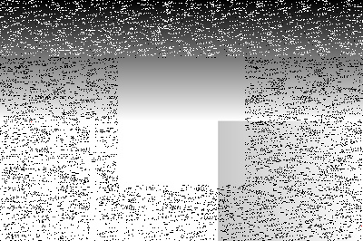 |

**Parameter sweep** (`grain_strength`): rendered at multiple values via the parameterized apply path (`--value V` / `--param NAME=V`):

| `0.00` | `+8.00` | `+25.00` | `+50.00` | `+100.00` |
|-|-|-|-|-|
|  |  |  |  |  |

### `vignette`

_Parameterized vignette (RFC-021). Pass --value V (CLI) or value: V (MCP); range [-1.0, +1.0] (negative darkens corners; positive lifts). Replaces the v1.5.x discrete vignette_subtle / vignette_medium / vignette_heavy entries with a single continuous-magnitude primitive._

| ColorChecker (global) | Grayscale (global) |
|-|-|
|  | 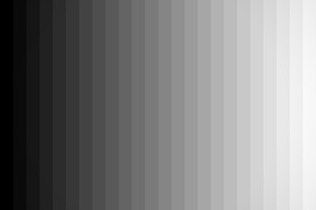 |

> 🚫 **Masked variant suppressed**: see [mask-applicable-controls](mask-applicable-controls.md#vignette) for why drawn-mask binding doesn't render usefully for this module.

_(near-baseline diff in ColorChecker (global): subtle vignette is small at the modest gallery render size; effect is concentrated at the very corners of the frame)_

_(near-baseline diff in grayscale (global): subtle vignette is small at the modest gallery render size; effect is concentrated at the very corners of the frame)_

**Parameter sweep** (`brightness`): rendered at multiple values via the parameterized apply path (`--value V` / `--param NAME=V`):

| `-0.80` | `-0.50` | `-0.25` | `0.00` |
|-|-|-|-|
|  | 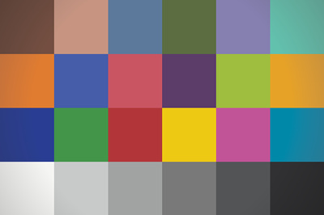 |  |  |

### `highlights_clip_threshold`

_Parameterized highlight-recovery clip threshold (RFC-021). Pass --value V; range [0.0, 2.0]: lower = more aggressive recovery (0.95 = subtle, 0.85 = strong, 0.5 = aggressive). Default 1.0 (darktable default; recovers only above 1.0). Replaces the v1.5.x discrete highlights_recovery_subtle / highlights_recovery_strong entries._

| ColorChecker (global) | Grayscale (global) | ColorChecker (centered ellipse mask) | Grayscale (centered ellipse mask) |
|-|-|-|-|
|  | 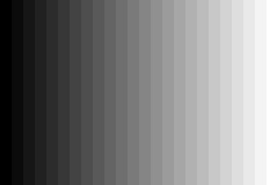 |  | 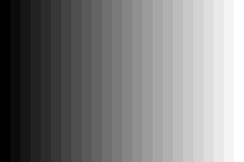 |

_(near-baseline diff in ColorChecker (global): this chart has no blown highlights to recover — see the **clipped-gradient row below** for the visible effect, or [mask-applicable-controls](mask-applicable-controls.md#highlights))_

_(near-baseline diff in grayscale (global): this chart has no blown highlights to recover — see the **clipped-gradient row below** for the visible effect, or [mask-applicable-controls](mask-applicable-controls.md#highlights))_

_(near-baseline diff in ColorChecker (masked): this chart has no blown highlights to recover — see the **clipped-gradient row below** for the visible effect, or [mask-applicable-controls](mask-applicable-controls.md#highlights))_

_(near-baseline diff in grayscale (masked): this chart has no blown highlights to recover — see the **clipped-gradient row below** for the visible effect, or [mask-applicable-controls](mask-applicable-controls.md#highlights))_

**On the clipped-gradient fixture** (continuous tone + blown highlights — chart designed to show this module's effect; see [`reference-targets/README.md`](https://github.com/chipi/chemigram/blob/main/tests/fixtures/reference-targets/README.md)):

| Clipped gradient (global) | Clipped gradient (centered ellipse mask) |
|-|-|
| 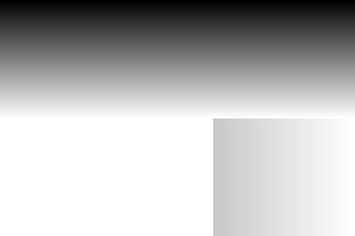 |  |

**Parameter sweep** (`clip_threshold`): rendered at multiple values via the parameterized apply path (`--value V` / `--param NAME=V`):

| `+0.50` | `+0.85` | `+0.95` | `+1.00` | `+1.50` |
|-|-|-|-|-|
| 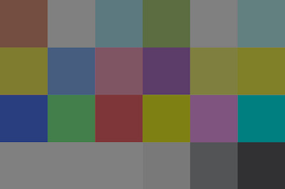 | 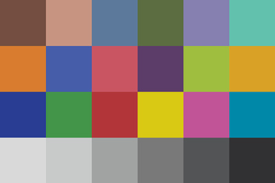 |  |  |  |

### `sigmoid_contrast`

_Parameterized sigmoid tone-curve contrast (RFC-021). Pass --value V (CLI) or value: V (MCP); range [0.5, 5.0] (1.0 = mild s-curve, 1.5 = darktable default / no curve change, 2.5 = aggressive s-curve). Replaces the v1.5.x discrete contrast_low / contrast_high entries with a single continuous-magnitude primitive._

| ColorChecker (global) | Grayscale (global) | ColorChecker (centered ellipse mask) | Grayscale (centered ellipse mask) |
|-|-|-|-|
| 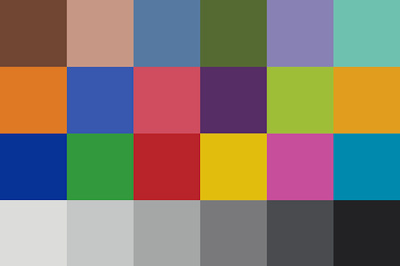 | 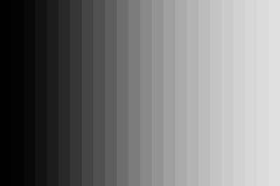 | 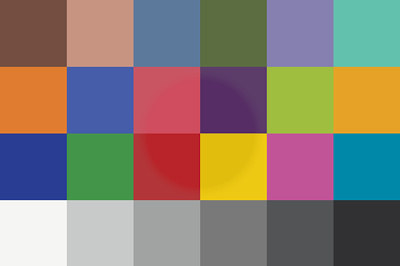 | 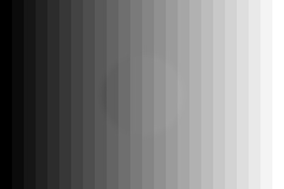 |

**Parameter sweep** (`contrast`): rendered at multiple values via the parameterized apply path (`--value V` / `--param NAME=V`):

| `+0.50` | `+1.00` | `+1.50` | `+2.00` | `+2.50` |
|-|-|-|-|-|
|  |  |  | 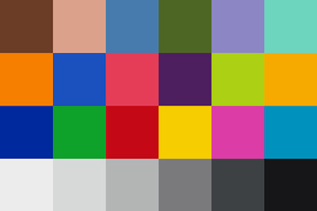 | 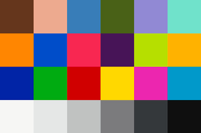 |

### `blacks_lifted`

_Lift target black to 0.5._

| ColorChecker (global) | Grayscale (global) | ColorChecker (centered ellipse mask) | Grayscale (centered ellipse mask) |
|-|-|-|-|
|  |  |  |  |

### `blacks_crushed`

_Crush blacks: target 0.001 + skew -0.3._

| ColorChecker (global) | Grayscale (global) | ColorChecker (centered ellipse mask) | Grayscale (centered ellipse mask) |
|-|-|-|-|
|  |  |  |  |

### `whites_open`

_Open whites: target 300 (3x default)._

| ColorChecker (global) | Grayscale (global) | ColorChecker (centered ellipse mask) | Grayscale (centered ellipse mask) |
|-|-|-|-|
|  |  |  |  |

### `bilat_clarity_strength`

_Parameterized clarity strength on bilat / local laplacian (RFC-021). Pass --value V; range [-1.0, 4.0]. 1.5 = clarity_strong-equivalent. clarity_painterly stays as a separate discrete entry — different kind, not strength._

| ColorChecker (global) | Grayscale (global) | ColorChecker (centered ellipse mask) | Grayscale (centered ellipse mask) |
|-|-|-|-|
|  | 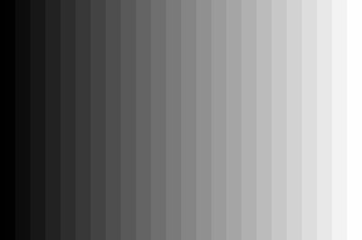 |  | 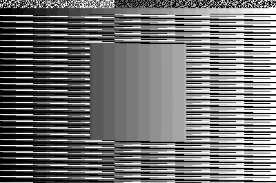 |

_(near-baseline diff in ColorChecker (global): below visible threshold on this chart input)_

_(near-baseline diff in grayscale (global): below visible threshold on this chart input)_

_(near-baseline diff in ColorChecker (masked): below visible threshold on this chart input)_

**Parameter sweep** (`clarity_strength`): rendered at multiple values via the parameterized apply path (`--value V` / `--param NAME=V`):

| `-0.50` | `0.00` | `+0.50` | `+1.50` | `+2.50` |
|-|-|-|-|-|
| 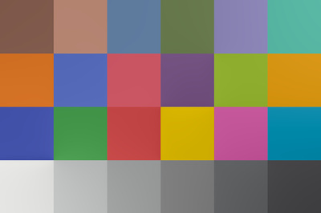 |  |  | 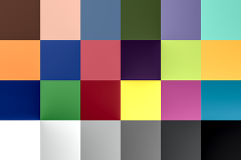 |  |

### `clarity_painterly`

_Soft painterly local contrast (detail 0.4)._

| ColorChecker (global) | Grayscale (global) | ColorChecker (centered ellipse mask) | Grayscale (centered ellipse mask) |
|-|-|-|-|
|  |  |  |  |

### `exposure`

_Parameterized exposure compensation (RFC-021). Pass --value V (CLI) or value: V (MCP) in EV stops; range [-3.0, +3.0]. Replaces the v1.5.x discrete expo_+0.3 / expo_+0.5 / expo_-0.3 / expo_-0.5 / shadows_global_+/- entries with a single continuous-magnitude primitive._

| ColorChecker (global) | Grayscale (global) | ColorChecker (centered ellipse mask) | Grayscale (centered ellipse mask) |
|-|-|-|-|
|  |  | 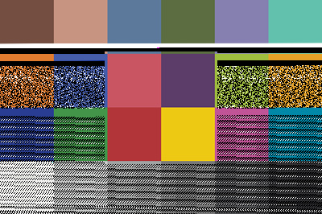 |  |

_(near-baseline diff in ColorChecker (global): below visible threshold on this chart input)_

_(near-baseline diff in grayscale (global): below visible threshold on this chart input)_

_(near-baseline diff in ColorChecker (masked): below visible threshold on this chart input)_

_(near-baseline diff in grayscale (masked): below visible threshold on this chart input)_

**Parameter sweep** (`ev`): rendered at multiple values via the parameterized apply path (`--value V` / `--param NAME=V`):

| `-1.00` | `-0.50` | `0.00` | `+0.50` | `+1.00` |
|-|-|-|-|-|
|  |  |  | 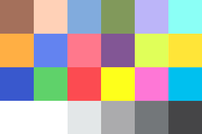 | 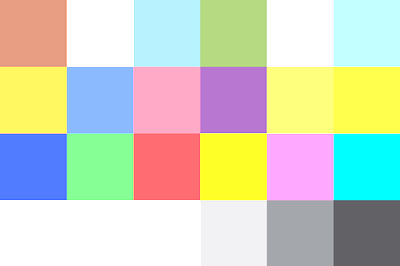 |

### `temperature`

_Parameterized white balance (RFC-021; first multi-parameter ship). Two axes: --param red_coeff=V (warmer image: red↑) and --param blue_coeff=V (cooler image: blue↑). Range [0.5, 4.0] each; both default 1.0 (no shift). Replaces the v1.5.x discrete wb_cool_subtle entry. Starter's wb_warm_subtle remains as a discrete teaching artifact; production use of WB shifts should prefer this parameterized entry._

| ColorChecker (global) | Grayscale (global) |
|-|-|
|  |  |

> 🚫 **Masked variant suppressed**: see [mask-applicable-controls](mask-applicable-controls.md#temperature) for why drawn-mask binding doesn't render usefully for this module.

_(near-baseline diff in ColorChecker (global): below visible threshold on this chart input)_

_(near-baseline diff in grayscale (global): below visible threshold on this chart input)_

### `saturation_global`

_Parameterized global saturation in colorbalancergb (RFC-021). Pass --value V (CLI) or value: V (MCP); range [-1.0, +1.0] (-1.0 = fully desaturated / monochrome; +0.5 = strong boost). Replaces the v1.5.x discrete sat_kill / sat_boost_moderate / sat_boost_strong entries with a single continuous-magnitude primitive._

| ColorChecker (global) | ColorChecker (centered ellipse mask) |
|-|-|
|  | 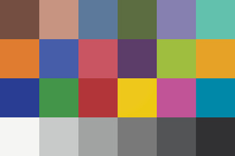 |

> **Grayscale column omitted**: this primitive moves chroma only; gray patches have no chroma to affect.

_(near-baseline diff in ColorChecker (global): below visible threshold on this chart input)_

_(near-baseline diff in ColorChecker (masked): below visible threshold on this chart input)_

**Parameter sweep** (`saturation_global`): rendered at multiple values via the parameterized apply path (`--value V` / `--param NAME=V`):

| `-1.00` | `-0.50` | `0.00` | `+0.25` | `+0.50` |
|-|-|-|-|-|
|  |  |  |  | 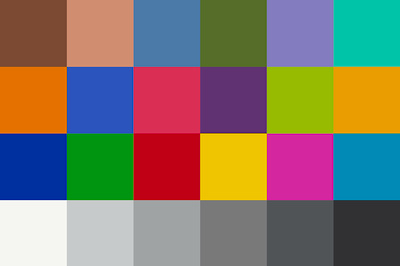 |

### `vibrance_+0.3`

_Global vibrance +0.3._

| ColorChecker (global) | ColorChecker (centered ellipse mask) |
|-|-|
|  |  |

> **Grayscale column omitted**: this primitive moves chroma only; gray patches have no chroma to affect.

### `grade_shadows_warm`

_Warm shadows (orange tint, hue 30 deg, chroma 0.3)._

| ColorChecker (global) | Grayscale (global) | ColorChecker (centered ellipse mask) | Grayscale (centered ellipse mask) |
|-|-|-|-|
|  |  |  |  |

### `grade_shadows_cool`

_Cool shadows (blue tint, hue 210 deg, chroma 0.3)._

| ColorChecker (global) | Grayscale (global) | ColorChecker (centered ellipse mask) | Grayscale (centered ellipse mask) |
|-|-|-|-|
|  |  |  |  |

### `grade_highlights_warm`

_Warm highlights (orange tint, hue 45 deg, chroma 0.2)._

| ColorChecker (global) | Grayscale (global) | ColorChecker (centered ellipse mask) | Grayscale (centered ellipse mask) |
|-|-|-|-|
|  |  |  |  |

### `grade_highlights_cool`

_Cool highlights (blue tint, hue 200 deg, chroma 0.2)._

| ColorChecker (global) | Grayscale (global) | ColorChecker (centered ellipse mask) | Grayscale (centered ellipse mask) |
|-|-|-|-|
|  |  |  |  |

### `chroma_boost_shadows`

_Boost shadow chroma +0.3._

| ColorChecker (global) | ColorChecker (centered ellipse mask) |
|-|-|
|  |  |

> **Grayscale column omitted**: this primitive moves chroma only; gray patches have no chroma to affect.

### `chroma_boost_midtones`

_Boost mid-tone chroma +0.3._

| ColorChecker (global) | ColorChecker (centered ellipse mask) |
|-|-|
|  |  |

> **Grayscale column omitted**: this primitive moves chroma only; gray patches have no chroma to affect.

### `chroma_boost_highlights`

_Boost highlight chroma +0.3._

| ColorChecker (global) | ColorChecker (centered ellipse mask) |
|-|-|
|  |  |

> **Grayscale column omitted**: this primitive moves chroma only; gray patches have no chroma to affect.

### `gradient_top_dampen_highlights` 🟦 mask-bound

_Dampen top-half highlights via -0.5 EV through a top-bright gradient._

| ColorChecker | Grayscale ramp |
|-|-|
|  |  |

### `gradient_bottom_lift_shadows` 🟦 mask-bound

_Lift bottom-half shadows via +0.4 EV through a bottom-bright gradient._

| ColorChecker | Grayscale ramp |
|-|-|
|  |  |

### `radial_subject_lift` 🟦 mask-bound

_Lift +0.6 EV in a centered radial mask region (subject emphasis)._

| ColorChecker | Grayscale ramp |
|-|-|
|  |  |

### `rectangle_subject_band_dim` 🟦 mask-bound

_Dim -0.3 EV in a horizontal mid-band rectangle (de-emphasize a horizon line)._

| ColorChecker | Grayscale ramp |
|-|-|
|  |  |

---

## Notes

- **Inputs are sRGB PNGs**, not raw files. darktable processes them through its non-raw path — input color profile applies, demosaic does not. Some primitives (e.g., raw-aware white-balance moves) behave differently from how they would on a real raw. The gallery is for *visual response validation*, not pipeline calibration; for raw-pipeline direction-of-change validation see the e2e suite in [`tests/e2e/`](https://github.com/chipi/chemigram/blob/main/tests/e2e/).

- **Mask-bound entries** (gradient/ellipse/rectangle, marked 🟦 above) route through the drawn-mask apply path per ADR-076. The mask geometry encodes into the XMP's `masks_history`; you see the spatial shaping in the rendered chart.

- **Out-of-gamut patches** on the ColorChecker (notably patch #18 Cyan) clip to nearest in-gamut sRGB; that clipping is in the input, not the primitive. See [`reference-targets/README.md`](https://github.com/chipi/chemigram/blob/main/tests/fixtures/reference-targets/README.md).
