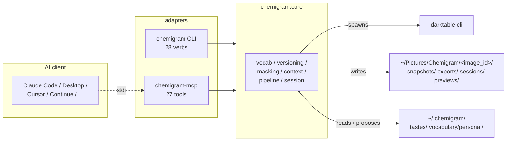

# Chemigram

Agent-driven photo editing on darktable — conversationally over MCP, or programmatically via the CLI.

[Get started](getting-started.md){ .chem-cta }
[GitHub →](https://github.com/chipi/chemigram){ .chem-cta .chem-cta--ghost }

> *Chemigram is to photos what Claude Code is to code.*

A craft-research project. The agent reads your taste, you describe intent, the agent edits via a vocabulary of named moves on top of darktable. Sessions accumulate; the project gets richer over time.

**v1.10.0 shipped May 2026** — Phase 1 closed at v1.0.0; v1.6–v1.8 closed Lightroom daily-use parity (51/52, 98%); v1.9.0 closed the mask + retouch architecture trilogy (RFC-024/025/026/029 + ADR-084..087); v1.10.0 added photographer-workflow vocabulary (29 new L2 looks across 6 genres + bw_convert v2) plus three workflow primitives — parametric L2 strength (RFC-035 / ADR-088), mixed-op `apply_per_region` (RFC-036 / ADR-089), `propagate_state` LR-Sync analog (RFC-037 / ADR-090). Phase 2 (use-driven vocabulary maturation) in progress; **114 vocabulary entries** shipped.

---

## Three doors in

Depending on what you came here for:

| If you want to... | Start here | Time |
|-|-|-|
| **Run chemigram on a real photo** | [Getting started](getting-started.md) | 30–60 min setup + first session |
| **Know "I want X look — how?"** | [Cookbook](guides/cookbook.md) — ~60 intent-driven recipes by genre | as needed |
| **Understand chemigram deeply** | [Onboarding guide](onboarding.md) — opinionated reading order through the doc tree | 2.5–3 hours |

Visual companion: [Architecture diagrams](diagrams/index.md) — stack, mask trilogy, vocabulary layers, release timeline (4 Mermaid one-pagers, render inline on GitHub).

---

## The question

Can a photographer transmit taste through language and feedback? And does an agent develop something resembling judgment when given good tools, good vocabulary, and a real craftsperson in the loop?

Chemigram is a probe — into where photographic taste lives, how it transmits, and what an agent can do with the right substrate. Not a Lightroom replacement. Not a digital asset manager. Not a service that automates editing or replaces the photographer.

## Built on darktable

Every pixel decision in chemigram is made by [**darktable**](https://www.darktable.org/) — the open-source raw photography workflow that has quietly become one of the best photo processing engines in the world. Scene-referred pipeline, perceptually accurate color science, sigmoid + filmic tone mapping, the colorequal HSL panel, lens correction via lensfun, denoising profiles per-camera, drawn-form masks with feathered blendif, parametric range masks, retouch heal/clone — all of it ships in darktable, written by a community of photographers and engineers over more than a decade. Strip chemigram away and darktable still produces the same beautiful renders; strip darktable away and chemigram is a pile of JSON.

If you ship raw work, the [darktable user manual](https://docs.darktable.org/usermanual/) and [darktable GitHub](https://github.com/darktable-org/darktable) are worth your time. The work that team has done makes everything chemigram does possible — *darktable does the photography, Chemigram does the loop*. See `docs/concept/02-project-concept.md` for the architectural commitment.

## The premise

Photo editing is an act of taste. When a photographer works through a raw, what's happening isn't slider-pushing — it's intent expressed through tooling. The slider is the *medium*; the move is the *intent*. Tools that make sliders easier to find don't change what's hard about photo editing. The hard part is the move, not the slider.

Modern agents can hold language richly. They can read intent. They can look at images. They can reason about composition. And they have infinite patience for iteration. The question is whether all that capability, given a substrate built for collaboration rather than automation, can become something more than a slider-pushing tool — a partner in the work.

## What it looks like

A photographer drops a raw into a workspace. Writes a brief — *"underwater shot of an iguana in the Galápagos. Adjust for underwater and color correct to get nice blues, but keep the iguana in natural colors. Dampen the bright sun-glare at the top. Lift the foreground a touch."*

The agent reads the photographer's accumulated taste from `~/.chemigram/tastes/_default.md`. Reads the brief. Looks at the image. Applies vocabulary primitives — `colorcal_underwater_recover_blue`, `gradient_top_dampen_highlights`, `gradient_bottom_lift_shadows`, `radial_subject_lift`. Renders previews. Surfaces composition tensions the brief glossed over. Snapshots at every meaningful state. Proposes additions to the photographer's taste files at session end.

The photographer reads previews. Says yes or no. Branches when curious. Tags the result. Exports.

Twenty-five conversational turns. One photo, deeply edited. Five new vocabulary entries surfaced as gaps for later authoring. Two new lines added to a taste file that future sessions inherit. The next image will go faster because the project has accumulated state.

## How it works

For the four-diagram architecture set (stack, mask trilogy, vocabulary layers, release timeline) see [`docs/diagrams/`](diagrams/index.md).

Four engine subsystems plus two adapter layers:

1. **Vocabulary** — manifest-driven `.dtstyle` primitives, layered L1 / L2 / L3 (camera baseline / look / creative); mask-bound entries declare drawn-form geometry in `mask_spec`.
2. **Versioning** — content-addressed DAG of XMP snapshots. Branches, tags, the works.
3. **Masking** — drawn-form geometry (gradient/ellipse/rectangle/path) encoded into darktable's XMP `masks_history`; parametric range filters (luminance + HSL color) via blendif bytes; LLM-vision-as-provider for content-derived masks (RFC-026 / ADR-086) using the chat-client's vision capability; spot heal/clone via the `apply_spot` MCP tool (RFC-025 / ADR-087). Per ADR-076 (v1.5.0) the PNG-based masker was retired; content-aware masking is now layered: byte-level for darktable-native cases, LLM-vision for coarse subject identification, deployed sibling providers (RFC-030 deferred) for the precision tier.
4. **Context** — multi-scope tastes (`_default.md` + genre files), per-image `brief.md` and `notes.md`, JSONL session transcripts, vocabulary gaps.
5. **MCP server** — 27 tools that adapt the engine for any MCP-capable client (Claude Code, Cursor, Continue, Cline, Zed, Claude Desktop, …).
6. **CLI** (v1.3.0+) — `chemigram` binary, mirroring the MCP tool surface verb-for-verb. Subprocess-callable for batch processing, custom agent loops, and CI scripts.

## Two planes of control

Chemigram exposes the same engine through two adapters:

- **Conversational (MCP).** Long-lived session with an agent in an MCP-capable client. The agent reads context, proposes moves, you respond, the loop continues for as many turns as the photo needs. Session transcripts record everything. This is the surface PRD-001 (Mode A) is built around. Use this when editing one image deeply with an AI collaborator at the keyboard.
- **Programmatic (CLI).** Subprocess calls from shell scripts, custom Python loops, batch jobs, watch-folder daemons, CI pipelines. No session lifecycle; each invocation is one operation. Stable exit codes (`0` success, `2` invalid, `3` not found, `5` versioning, `6` darktable, `7` mask binding…); newline-delimited JSON output via `--json`. Use this when the agent has already decided, or when no agent is involved at all.

Same engine, same vocabulary, same workspace state on disk. The choice between MCP and CLI is about workflow shape — conversational vs. scripted — not capability. PRD-005 / RFC-020 cover the design; `docs/getting-started.md` walks both paths.

## Why this earns existence

**Photography editing is actually agent-shaped.** Most creative work isn't — it requires too much continuous human judgment to delegate. But raw-to-final development is iterative, parameter-rich, well-suited to vocabulary, and (crucially) has previews — every move is checkable in a few seconds. The loop is tight; the agent has tools; the photographer judges. This is a domain where the apprenticeship model fits.

**The Claude Code analogy is real, not metaphorical.** Coding assistants found a working shape: project context, agent loop, accumulated state, version control, iterative tools, propose-and-confirm. Chemigram applies that exact shape to photo work. A photo is a project. `tastes/_default.md` is `CLAUDE.md`. Vocabulary primitives are filesystem tools. Snapshots are commits. The shape transfers.

**The substrate exists.** darktable provides the rendering, color science, masks, modules — already mature, already OSS. MCP provides the agent protocol. The chat-client's vision-capable LLM (Claude.ai / ChatGPT / Claude Code) provides content-derived masking today (RFC-026 / ADR-086) — zero deployment cost. SAM (and successors) provide pixel-precise segmentation when the precision tier lands as RFC-030's deployed sibling-provider scaffolding. Every piece needed is available. The novel contribution is the integration layer and the agent's behavioral patterns — bounded engineering, not research uncertainty.

## What success looks like

Not "the agent edits well." Something deeper.

A photographer who's used Chemigram for six months has:

- Taste files that articulate their photographic intent in a structured, evolving way — readable by them, by the agent, by another photographer trying to understand their work
- A vocabulary of 100–200 named moves capturing how they actually edit, encoded as portable `.dtstyle` files
- Hundreds of session transcripts showing how their taste developed in negotiation with the agent
- Per-image notes carrying forward subject identifications, lighting decisions, branch explorations
- Sessions that take 12 turns instead of 25 because context compounds

That's a research artifact in itself: a portrait of how one photographer edits, externalized through use. It's also a working tool that gets better the more it's used.

The compounding is the point. The first session is interesting; the fiftieth is what justifies the project.

## What it is not

| Not a... | Because... |
|-|-|
| **Lightroom replacement** | Chemigram is per-image research, not a daily-driver photo workflow. Use your real DAM for cataloging and bulk exports. Use Chemigram when you want to work with an apprentice on a specific image. |
| **Bulk-editing tool** | The whole point is depth, not throughput. One photo at a time, deeply. |
| **Digital asset manager** | No catalog, no smart collections, no search. Out of scope by design. |
| **"Make my photos professional" service** | Chemigram doesn't have taste of its own. It has *your* taste, articulated through use. The starter vocabulary is deliberately minimal so users build their own voice rather than inheriting a generic one. |
| **A test of whether AI can replace the photographer** | The opposite. The agent makes the photographer's work tractable and the loop fast. Every meaningful decision still goes through the photographer. The compounding is real but bounded — the agent is an apprentice, not a successor. |

## The deeper bet

Most attempts to apply AI to creative work either over-claim ("AI does the creative work") or under-claim ("AI assists with mechanical tasks"). Both miss the interesting middle: **AI as partner in articulating craft**.

A photographer's taste lives partly in language ("subtle red recovery"), partly in the moves they reach for repeatedly, partly in pre-verbal judgment they recognize when they see it. None of these is fully captured by any current tool. Chemigram bets that the right substrate — vocabulary as action space, agent as patient reader of intent, externalized context that compounds — can capture all three, in a way the photographer is in control of.

If the bet works, the photographer ends up with something more than edited photos: an articulated craft. If it doesn't, we'll have learned where craft resists language, where agent-collaboration breaks down, and what shape of tool would actually help. Either way, the question is worth asking.

---

[Install and run your first session →](getting-started.md){ .chem-cta }

**Want to understand the project deeply (not just use it)?** See the [onboarding guide](onboarding.md) — opinionated 2.5–3 hour reading order through the concept package, mask architecture, and cookbook.

For project internals — the concept package, definition documents (PRDs / RFCs / ADRs), implementation plan — see the **Project Internals** section in the sidebar, or jump to the [doc tree](doc-tree.md).
