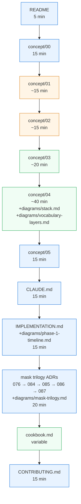

# Onboarding — read this if you want to understand chemigram deeply

> Opinionated reading order for new contributors. Closes
> [#117](https://github.com/chipi/chemigram/issues/117).
> **Approximate total reading time: 2.5–3 hours** (concept docs are the longest stretch).

The doc tree is rich but discovery is ad-hoc — new contributors land in the README and have to navigate `concept/`, `prd/`, `rfc/`, `adr/`, `IMPLEMENTATION`, `CONTRIBUTING`, and `guides/` on their own. This guide is the path through it.

If you only have 30 minutes, read steps 1–3. If you have 90 minutes, add steps 4–6. The full 2.5–3 hour walk is for people who want to write code or vocabulary against the project.

---

## 1. The elevator pitch (5 min) — `README.md`

Start here. What chemigram is, what it isn't, the latest release, the "How it works" stack diagram, the quick-start install, and a typical 6-turn session example.

**Specifically read:** the magazine-style lede, the "Built on darktable" section (chemigram makes no pixel decisions of its own — every render is darktable's work), and "What makes it different" (the three foundational disciplines).

**Skip on first pass:** the verbose roadmap table, the in-depth examples below the lede.

---

## 2. The founding narrative (15 min) — `docs/concept/00-introduction.md`

The introductory concept doc. What problem chemigram solves, who it's for, what the design space looks like. Written as prose, not as a feature list.

**Why it matters:** every architectural decision later in the project anchors to claims made in the concept docs. If you can't articulate the founding narrative, the ADRs will feel arbitrary.

---

## 3. The vision and concept (~30 min) — `docs/concept/01-vision.md` + `docs/concept/02-project-concept.md`

`01-vision` is the long-form "why does this exist" essay. The thesis: photo editing is an act of taste; modern agents can hold language; the question is whether a photographer can transmit taste through language + feedback.

`02-project-concept` is the closest thing to a product description. The vocabulary system (L1/L2/L3), Mode A vs Mode B, the agent-as-apprentice framing.

**Specifically read:** § 1.1 The work (in 01), § 2 The two modes (in 02), § 6 The vocabulary system (in 02).

---

## 4. The data and architecture (~1 hr) — `docs/concept/03-data-catalog.md` + `docs/concept/04-architecture.md`

`03-data-catalog` describes the on-disk shape: per-image repos, tastes/, vocabulary/, sessions/, snapshots/. Read this before any code that touches the filesystem.

`04-architecture` is the technical architecture doc — engine subsystems, the XMP foundation, the vocabulary approach, SET semantics, why darktable does the photography. The section count is high but each section is short.

**Visual one-pager companion:** [`docs/diagrams/stack.md`](diagrams/stack.md) and [`docs/diagrams/vocabulary-layers.md`](diagrams/vocabulary-layers.md). Skim these before diving in to anchor the mental model.

**Specifically read:** § 1 Design principles (in 04), § 2 Subsystems (in 04), § 4 The vocabulary approach (in 04), § 3 The XMP foundation (in 04 — necessary if you'll touch the synthesizer).

---

## 5. The design system (15 min) — `docs/concept/05-design-system.md`

The naming + style conventions. Filename schemes, voice rules, when to write a PRD vs an RFC vs an ADR. Faster to skim than to memorize; you'll come back to it when authoring.

---

## 6. The operational handbook (15 min) — `CLAUDE.md`

The how-do-we-do-things guide for AI agents (and humans) working on the project. Three foundational disciplines, doc system at a glance, voice rules, naming conventions, code conventions, the easy-to-get-wrong list.

**Why it matters:** this is the file that AI assistants load at session start. If you're going to work on chemigram with an agent, reading this is the same as reading what your agent is reading. Stays under 5 minutes once you know it; the first read is the slow one.

---

## 7. The release phases (15 min) — `docs/IMPLEMENTATION.md` + `docs/diagrams/phase-1-timeline.md`

The canonical phase plan. Which phase shipped what, what's left, what's deferred. The timeline diagram is the fast version; the markdown table has the per-phase RFC/ADR breakdown.

**Specifically read:** the status snapshot table (top of `IMPLEMENTATION.md`) and the Phase 2 framing.

---

## 8. The mask architecture trilogy (20 min) — five ADRs in sequence

The current mask system (closed in v1.9.0–v1.10.0) is the most architecturally interesting subsystem after the synthesizer. Read these five ADRs in order — each is short and they build:

1. **ADR-076** — drawn-mask-only architecture. Retired the PNG-mask path that turned out to be a silent no-op. Foundation for everything that comes after.
2. **ADR-084** — apply-time mask spec semantics + the build-by-words pattern. The `mask_spec` wire that every mask source converges on.
3. **ADR-085** — parametric range filter encoding via blendif bytes. Luminance + HSL color range masks.
4. **ADR-086** — LLM-vision-as-provider for AI-derived masks. The conversation-native mask construction pattern.
5. **ADR-087** — retouch byte encoding + the `apply_spot` MCP tool. Heal/clone as a sister wire to mask_spec.

**Visual one-pager:** [`docs/diagrams/mask-trilogy.md`](diagrams/mask-trilogy.md) — the four mask sources converging on one `mask_spec` wire that serializes to XMP `masks_history`.

---

## 9. The cookbook (variable) — `docs/guides/cookbook.md`

~60 worked recipes pulling from the v1.10.0 vocabulary. Browse the genre that matches your photographic interest. Cinematic / portrait / landscape / B&W / wildlife / food / mask-driven moves / workflow primitives.

This is the **practical** entry point. You don't have to read every recipe; the goal is to internalize the recipe-shape so you can write your own.

---

## 10. The contribution flows (15 min) — `docs/CONTRIBUTING.md`

How code contributions are reviewed. How vocabulary contributions are reviewed. They're meaningfully different — vocabulary review centers on photographic intent + scope discipline + visual proofs; code review centers on the three foundational disciplines + ADR alignment.

---

## What to read NEXT (depends on what you want to do)

**If you're going to write code:**
- `docs/adr/TA.md` (the technical architecture reference; pull-up-by-anchor format, not read-through)
- `docs/rfc/` (open technical questions; read the ones whose subsystem you'll touch)
- `docs/adr/index.md` (the full ADR catalog; read the relevant subsystem's ADRs in order)

**If you're going to write vocabulary entries:**
- `docs/guides/authoring-vocabulary-entries.md`
- `docs/guides/vocabulary-patterns.md`
- `docs/guides/expressive-baseline-authoring.md` (the programmatic Path C methodology)
- `vocabulary/packs/expressive-baseline/manifest.json` (read 5-10 entries; absorb the shape)

**If you're going to write docs:**
- `docs/rfc/RFC_TEMPLATE.md` (and existing RFCs that closed — read 3-4 to absorb the voice)
- `docs/adr/ADR_TEMPLATE.md` (same — read 3-4 recent ones; ADR-088 / 089 / 090 are good examples of the Draft-pending-validation shape)
- The voice rules in `CLAUDE.md`

**If you're going to use chemigram (not contribute):**
- `docs/getting-started.md` (setup walkthrough; lives outside this guide because it's "use," not "understand")
- The cookbook (step 9 above)
- Skip everything else until you have a session under your belt that surfaced a question.

---

## Reading order at a glance

Blue = 15 min or less. Orange = ~15–30 min. Green = longer.

---

## Common stumbling blocks (and what to do about them)

**"There's no L4 / L5 vocabulary layer?"** No — the 3-layer system is finite by design (ADR-001). Composition happens at L2; primitives live at L3; camera baselines are L1.

**"Why is the API surface so narrow?"** Deliberate restraint (CLAUDE.md § "The three foundational disciplines"). 27 MCP tools is enough; adding tools without an ADR doesn't make the project better.

**"Why doesn't chemigram bundle AI?"** "Bring Your Own AI" is one of the three foundational disciplines. Maskers, evaluators, the agent itself — all provider-configured at runtime. The engine has zero AI dependencies.

**"Why so many RFCs?"** Because each one captures an open question with honest alternatives at the time, then closes into ADRs once a decision is made. The RFC's job is the deliberation; the ADR's job is the commitment. Read the closing ADR for what was decided; read the RFC for why.

**"This file says X but the code does Y."** Open an issue with the specific file:line and the divergence. Drift between code and docs is treated as a bug (see `tests/integration/cli/test_cli_mcp_param_alignment.py` for the audit tests that catch it). Active recent fixes: commits `adbc04e`, `33820ea`, `2169274`.

---

## See also

- [`docs/index.md`](index.md) — the public docs home (different audience: "use chemigram"; this onboarding guide targets "understand + contribute to chemigram")
- [`docs/diagrams/index.md`](diagrams/index.md) — the four architecture diagrams as a set
- [`docs/CONTRIBUTING.md`](CONTRIBUTING.md) — code + vocabulary contribution flows
- `CLAUDE.md` — the working-on-the-project handbook
